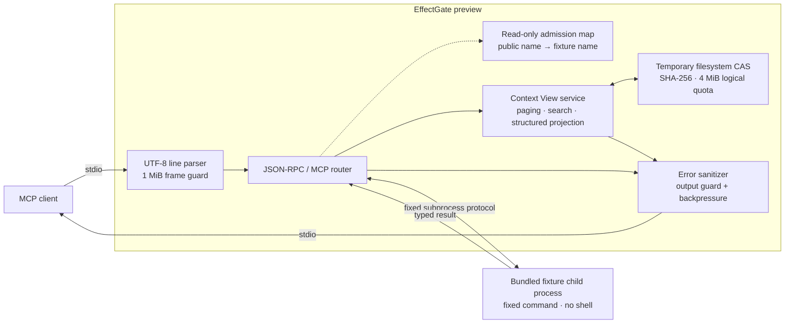

<div align="center">

# EffectGate

### Building a local control point for MCP tool context and effects.

**Design goal:** Spend tokens on reasoning, not tool noise.

[](#current-boundary)
[](poc/package.json)
[](https://nodejs.org/)
[](#protocol-surface)
[](LICENSE)
[](poc/package.json)

[Quick start](#quick-start) ·
[Architecture](#architecture) ·
[Protocol](#protocol-surface) ·
[Security](#security-model) ·
[MCP setup](#connect-an-mcp-client)

</div>

> [!CAUTION]
> **This is a Phase 1 preview.** Its bounded Context View path and reviewed
> read-only stdio binding are real and tested, but its small heuristic ruleset
> is not comprehensive secret protection. It cannot admit unreviewed
> executables, expose third-party writes, or provide a production security
> boundary.

EffectGate is being built to sit between an AI host and its MCP tools. The
product direction combines two controls that normally live far apart:

1. **Context control** — retain raw tool evidence locally and emit only bounded,
   cited views to the model.
2. **Effect control** — bind approval to an exact intent, then verify or
   reconcile the outcome instead of retrying blindly.

The preview proves the narrow transport and admission spine, then exercises the
first context-control paths end to end: large deterministic text becomes
bounded, deterministically redacted, cited pages, literal search windows, or
JSON/JSONL, CSV/TSV, and Markdown projections retrieved through opaque cursors.
Oversized untyped result envelopes are retained as serialized JSON, while
unsupported or deterministically opaque content is withheld without inventing
a summary.

## Quick start

Requires [Node.js 24 or newer](https://nodejs.org/). There are no runtime
packages to install.

```powershell
git clone https://github.com/Miniks040506/EffectGate.git
cd EffectGate
npm --prefix poc test
npm --prefix poc start
```

`npm --prefix poc start` launches a local stdio MCP server backed only by the
bundled deterministic fixture. No package installation or network listener is
involved.

To install the same preview as an `effectgate` command from a checked-out
repository:

```powershell
npm install --global ./poc
effectgate --version
effectgate mcp serve
```

The package contains only the runtime source, focused operating guide, and
Apache-2.0 license. Tests, qualification evidence, and design files are not
installed. Re-running the install command upgrades or reinstalls the CLI
without touching configuration or state stored outside the package directory.
The package defines no install or uninstall lifecycle scripts.

The manual `Tier 1 package qualification` workflow pins Node `24.14.0` and
qualifies Linux x64, Linux arm64, Windows x64, and macOS x64. GitHub's concrete
Linux runner images are Ubuntu 24.04 for x64 and arm64; this is runner evidence,
not an Ubuntu-only runtime restriction. Each cell runs the full suite, then
installs the pinned `0.16.0` package, upgrades to `0.17.0`, rolls back, and
upgrades again while proving external state remains unchanged. The workflow
uses `workflow_dispatch` only, so pushes do not start hosted runners
automatically.

Before uninstalling, print the exact package command, preserved paths, and
optional purge arguments:

```powershell
effectgate uninstall --config D:\path\to\effectgate.json
```

The default command is `npm uninstall --global effectgate-preview`; it removes
the CLI while preserving configuration, state, and skill sources. Optional
state deletion must happen before package removal: run `effectgate purge
--config FILE` to review the exact owned state path and receive confirmation
arguments, then rerun with the printed SHA-256 digest and `--yes`. Purge refuses
filesystem roots, overlapping configuration/skill paths, missing ownership
markers, and mismatched confirmations. It deletes state only.

## Architecture



There is no network listener. Without `--config`, the preview spawns only the
bundled fixture and `--source` changes only its public namespace. A reviewed
configuration may instead bind one exact digest-pinned stdio process.

## Implemented invariants

| Boundary | Current behavior |
|---|---|
| Backend selection | Bundled fixture or one exact reviewed stdio config; command-line backend injection is rejected |
| Process launch | `shell: false` with an explicit environment allowlist |
| Frame size | Incoming and outgoing JSON-RPC frames are limited to 1 MiB |
| Request IDs | Safe integers or UTF-8 strings no longer than 128 bytes |
| Work bound | At most 64 pending backend requests |
| Timeout | Each forwarded request expires after 10 seconds |
| Lifecycle | Exactly one successful initialization path per stdio process |
| Catalog | Calls require a public name learned from a `tools/list` page that passed the 64 KiB public-result guard |
| Compact mux | A session pinned to `compact_mux` exposes only bounded search, describe, call, and authenticated fetch tools; direct typed names are denied |
| Native deferral evidence | Deferral metadata requires an unexpired `pass` manifest, observed Tool Search, and exact client name/version/build match; EG-014B observed real Tool Search on Claude Code 2.1.220 |
| Name isolation | Backend names cannot be called directly or invented |
| Eligible results | Exact text above 4 KiB and oversized untyped envelopes are retained; small text with a redaction or opacity match is bounded too |
| Typed safety | A typed result that needs redaction or opaque handling fails closed instead of violating its `outputSchema` or exposing source bytes |
| Artifact storage | 64 KiB chunk writer into a privacy-partitioned SHA-256 filesystem CAS: 1 MiB per artifact, 4 MiB logical total, 16 artifacts |
| Finalization | File `fsync`, same-volume atomic rename, startup `.part` cleanup, same-partition deduplication, and full-hash read verification |
| Corruption | A missing, truncated, or hash-mismatched object fails closed; corrupt objects are moved to quarantine |
| Tool-result output | Every serialized tool-result value is capped at 64 KiB |
| Opaque content | Unsupported media, private-key armor, and conservative encoded-data matches return metadata-only `unavailable` views with no retrieval path or generated summary |
| Retrieval | HMAC-SHA256 authenticated cursors bind artifact, source view, next position, operation digest, budget, local-principal/client/session/policy digests, expiry, and nonce |
| Search | Case-sensitive literal search: 64-character query, five context lines, 1,024-token maximum, and one cited source-ordered window per page |
| Projection | JSON/JSONL pointer selection, CSV/TSV column selection, and Markdown heading extraction with a 1,000-item slice, 100 logical items per page, and a 1,024-token maximum |
| Continuity | Artifacts with an unfetched cursor are pinned; recent retries use a bounded page cache; explicit invalidation revokes cached and live cursors |
| Page bound | At most 4,096 source bytes, cut only at a valid UTF-8 boundary |
| Redaction | Versioned assignment, bearer-token, and common token-prefix rules run before every emitted page; more than 4,096 detected spans fails closed |
| Benchmark evidence | Seeded P0–P3 order, stable pair/run IDs, warm task timing, alternating long-lived native/proxy latency profiles, real execution of all four small-read fixture profiles, exclusive JSONL creation, retained failures, deterministic median/p95/bootstrap-CI reports, a fail-closed performance gate, and review-only exposure recommendations |
| Errors | Backend errors and stderr content are not passed through verbatim |
| Flow control | Client input and fixture output pause while downstream writables are backpressured |

An admitted tool must declare all four metadata conditions:

```text
readOnlyHint     = true
destructiveHint  = false
idempotentHint   = true
openWorldHint    = false
```

For admitted tools, advertised contract fields are forwarded unchanged; only
the name is replaced with a deterministic public namespace. Tool annotations
are still untrusted metadata—not proof that an unknown backend is safe.
Third-party exposure therefore also requires pinned executable/source bytes,
server identity, and an exact reviewed catalog.

## Context View contract

The published [Context View JSON Schema](contracts/context-view.schema.json)
and its [token-count definition](contracts/token-ledger.schema.json) are the
machine-readable runtime contract.

`fixture__large_log` demonstrates the first bounded-result path. An eligible
exact single-text result at or below 4 KiB passes through unchanged only when
no redaction or opacity rule matches. Larger exact text and oversized untyped
result envelopes are retained in the temporary CAS; non-text envelopes use
deterministic JSON serialization. The model receives a v1 Context View
containing:

- a deterministically redacted UTF-8 projection and its exclusive raw byte
  range;
- stable artifact and SHA-256 integrity digests;
- an explicit source-byte ceiling and honestly labeled byte-proxy token count;
- `partial_view` status whenever the page is not the whole artifact;
- an explicit `EG-VIEW-002` diagnostic whenever source data was omitted;
- an opaque continuation cursor when more bytes remain;
- redaction class, rule ID, and per-page occurrence counts plus the applied
  ruleset diagnostic.

Call `effectgate_fetch` with the returned cursor to retrieve the next page.
Raw citation ranges are contiguous. Pages reconstruct the original result byte
for byte only when no rule matches; matched bytes are replaced before the first
page or any fetched page leaves EffectGate. A same-session retry returns the
cached page while its bounded cursor state is retained. Cursor envelopes expire
after 10 minutes and contain no raw query or projection arguments. Expired,
modified, cross-process, and unknown cursors all return the same public error.
Repeated identical content reuses one logical artifact and one physical object
only inside its hashed privacy partition. Explicit invalidation removes that
partition's object and revokes every cached replay and live continuation for
the artifact without touching an identical object in another partition.

Token measurements now route through one basis-aware counter abstraction.
Context Views deliberately keep the existing deterministic `byte_proxy`
counter. Injected counters must identify themselves as `tokenizer_exact`,
`tokenizer_estimate`, or `host_reported`; calibrated estimates may include a
bounded disagreement measured against an exact reference counter. The bound is
the maximum `|measured-reference| / max(measured, reference, 1)` across the
provided calibration samples. No tokenizer is bundled, and a host-reported
value is never relabeled as a local measurement or a total-session saving.

One result-budget controller now guards text, search, projection, and
unavailable views. Configured first-view and fetched-page byte/token ceilings
are distinct; a caller may request less but cannot raise either ceiling. Every
view reports the applied limits, measured bytes and tokens, and one explicit
overflow policy from the public schema.

The proxy also guards cumulative model-visible tool catalogs and results. The
default process-local ceiling is 262,144 byte-proxy tokens and can be lowered
with `--max-session-emitted-tokens COUNT`. Identical retries count again;
rejected output does not mutate usage. This is EffectGate output accounting,
not a measurement or guarantee of prompts, assistant output, protocol errors,
or the host's total conversation context.

Pass `--token-ledger FILE` to persist one process session as validated JSONL.
Entries contain stage, direction, byte count, measurement basis, counter
identity/version, input digest, safe category, and trusted artifact/view IDs
when available. Raw tool content and protected arguments are never written.
Byte-proxy values are recomputed when the file is opened; truncated,
inconsistent, cross-session, or malformed ledgers fail closed.

Call `effectgate_search` with an `artifact_id` and literal `query` to retrieve a
bounded redacted context window. Optional `context_lines` ranges from zero
through five; `max_tokens` ranges from 64 through 1,024 and defaults to 512.
Repeated matches continue through the returned `effectgate_fetch` cursor.
Search is case-sensitive and source-ordered. It does not run regexes, semantic
ranking, or generated summaries. A context line too large for the requested
budget is labeled `partial_view` with an explicit clipping diagnostic.

Call `effectgate_project` with an `artifact_id`, a supported `format`, and an
optional `offset`/`limit` slice:

- `json` and `jsonl` accept RFC 6901 `fields` and scalar equality through
  `filter.pointer`;
- `csv` and `tsv` accept visible header `columns` and string equality through
  `filter.column`;
- `markdown` returns an ATX heading index by default, or the exact heading
  section selected by `heading`.

Structured output is bounded JSONL; Markdown sections remain Markdown.
`record_citations` maps every emitted item to raw source evidence, and
continuation uses `effectgate_fetch`. `max_tokens` ranges from 64 through
1,024 and defaults to 512. Malformed JSONL lines become cited diagnostics;
malformed JSON falls back to bounded redacted text without repair. Malformed
CSV/TSV fails closed because safe column-aware redaction cannot be guaranteed.
Markdown headings inside fenced code blocks are ignored. An item larger than
the requested budget is explicitly omitted with a cited diagnostic.

Unknown media types and content matched by the bounded
`opaque-byte-distribution-v1` screen are retained but return an empty
`unavailable` view. Fetch, search, and projection cannot reveal that artifact,
and EffectGate never labels the withheld bytes as encrypted or generates a
summary. The screen covers private-key headers, long tokens, wrapped base64-like
blocks, wrapped hexadecimal blocks, and bounded byte-distribution windows. It
can produce false positives; it is a fail-closed preview rule, not a secrecy
classifier.

> [!NOTE]
> The 4 KiB default bounds model-visible Context View content; text paging also
> bounds its cited source range. MCP and JSON envelope bytes are covered by a
> 64 KiB tool-result limit and the separate 1 MiB frame limit. Session metadata
> remains volatile. The proxy uses a
> process-owned temporary CAS removed on safe eviction or normal shutdown;
> cursors expire after 10 minutes.

## Protocol surface

The preview uses one UTF-8 JSON-RPC object per stdio line and supports MCP
`2025-11-25` only. This is a deliberately narrow MCP subset, not a protocol
conformance claim.

| Message | Direction | Behavior |
|---|---|---|
| `initialize` | Client → EffectGate | Requires the preview MCP version, pins the exposure/host-evidence decision, and starts a fresh cursor session |
| `notifications/initialized` | Client → EffectGate | Completes the lifecycle gate and is forwarded to the fixture |
| `ping` | Client → EffectGate | Forwarded under shared timeout and pending-work limits |
| `tools/list` | Client → EffectGate | Validates and namespaces tools, enforces contract/result ceilings, preserves pagination, and publishes either typed tools or the four compact contracts pinned at startup |
| `tools/call` | Client → EffectGate | Accepts only an admitted public name; eligible untyped output is bounded, while typed sensitive/opaque output fails closed |
| `effectgate_fetch` | Client → proxy | Consumes an opaque cursor locally and returns the next cited page |
| `effectgate_search` | Client → proxy | In typed mode, searches a retained artifact; in compact mode, searches bounded metadata for admitted capabilities |
| `effectgate_describe` | Client → proxy | Compact mode only: returns one admitted capability's exact input/output contract |
| `effectgate_call` | Client → proxy | Compact mode only: calls one admitted read-only capability through generic arguments |
| `effectgate_project` | Client → proxy | Applies bounded JSON/JSONL, CSV/TSV, or Markdown projection with source citations |
| `notifications/cancelled` | Client → fixture | Remaps the client request ID to its fixture request |
| `notifications/tools/list_changed` | Fixture → client | Clears stale admission before forwarding; active Context View chains remain valid |
| Other requests | Client → proxy | Return JSON-RPC `-32601` |
| Unrelated notifications | Either direction | Ignored |

The bundled fixture publishes `fixture__echo`, `fixture__echo_again`, and
`fixture__large_log`. The first two prove typed-result fidelity and catalog
pagination. The last one supplies deterministic multibyte UTF-8, JSONL, CSV,
and Markdown evidence plus an opt-in set of synthetic secret sentinels.

## Security model

The preview treats MCP input as adversarial but trusts the local
operating-system user, the Node.js runtime, and the checked-out repository
files.

The default `mcp serve` proxy is **not**:

- an operating-system sandbox;
- an authentication or encryption layer;
- a comprehensive secret/PII detector or tenant-isolation system;
- a durable indexed CAS or end-to-end streaming backend adapter;
- a durable audit journal;
- an independent JSON Schema validator for tool-call arguments;
- approved for unreviewed or write-capable external backends, protected
  effects, or production use.

The separate configured fixture command exercises the existing approval,
journal, idempotency, verification, and receipt kernel against an in-memory
reviewed driver or the exact bundled stdio fixture. EffectGate restarts
recover its journal and reconcile interrupted dispatches without blindly
repeating them. The memory backend is not restart-durable; the stdio fixture
stores idempotency evidence in its own SQLite file. Neither driver authorizes
arbitrary programs, imported modules, or production writes.

Read the full [security policy](SECURITY.md) for reporting, supported versions,
the current threat boundary, and known limitations.

## Connect an MCP client

Point an MCP client at the preview stdio process using an absolute path:

```json
{
  "mcpServers": {
    "effectgate": {
      "command": "node",
      "args": [
        "/absolute/path/to/EffectGate/poc/src/proxy/effectgate.mjs",
        "mcp",
        "serve"
      ]
    }
  }
}
```

For Claude Code:

```powershell
claude mcp add --transport stdio effectgate -- node /absolute/path/to/EffectGate/poc/src/proxy/effectgate.mjs mcp serve
```

### Reviewed third-party read backend

Calculate SHA-256 pins for the exact executable and every operator-reviewed
source file:

```powershell
node --input-type=module -e "import { reviewedFileDigest as digest } from './poc/src/proxy/reviewed-backend-config.mjs'; console.log(digest(process.argv[1]))" "D:\path\to\backend.exe"
```

Create a layered configuration with the exact launch binding, server identity,
and reviewed single-page `tools/list` result:

```json
{
  "schema_version": "1.0.0",
  "driver": "effectgate.reviewed.stdio-read.v1",
  "source": "reviewed",
  "executable_path": "D:\\path\\to\\backend.exe",
  "executable_digest": "sha256:REPLACE_WITH_64_HEX_CHARACTERS",
  "argv": [],
  "working_directory": "D:\\path\\to\\backend-work",
  "source_files": [],
  "server_identity": {
    "name": "reviewed-backend",
    "version": "1.0.0"
  },
  "catalog": {
    "tools": [{
      "name": "lookup",
      "inputSchema": {"type": "object"},
      "annotations": {
        "readOnlyHint": true,
        "destructiveHint": false,
        "idempotentHint": true,
        "openWorldHint": false
      }
    }]
  }
}
```

Capture and review the catalog out of band; EffectGate deliberately does not
auto-seal whatever an untrusted process reports. Start the proxy with:

```text
node /absolute/path/to/EffectGate/poc/src/proxy/effectgate.mjs mcp serve --config /absolute/path/to/reviewed-backend.json
```

The binding uses exact argv with no shell, a canonical working directory, the
base environment allowlist plus optional `secret_refs`, and repeated source
digest checks. Initialization must match the pinned MCP protocol and server
identity. The catalog must match byte-for-byte after canonical JSON
normalization, must be one immutable page, and may expose only tools carrying
all four safe-read annotations. Writes, dynamic catalogs, direct backend names,
invented names, source drift, and identity drift fail closed.

### Configured verified-effect fixture

Create a reviewed skill root containing `SKILL.md` and `phases/modify.md`.
The operator CLI can pin both source digests and create the reviewed stdio
configuration without overwriting an existing file. Preview first:

```powershell
node .\poc\src\proxy\effectgate.mjs init --config D:\path\to\effectgate.json --state D:\path\to\effectgate-state --skill-root D:\path\to\skill --target docs/guide.md --transaction reviewed-transaction --dry-run --json
```

Replace `--dry-run` with `--apply` after reviewing the paths. Diagnose without
starting the MCP runtime or creating a backend database:

```powershell
node .\poc\src\proxy\effectgate.mjs doctor --config D:\path\to\effectgate.json
node .\poc\src\proxy\effectgate.mjs status --config D:\path\to\effectgate.json
node .\poc\src\proxy\effectgate.mjs receipt --config D:\path\to\effectgate.json --id RECEIPT_ID
node .\poc\src\proxy\effectgate.mjs approve --config D:\path\to\effectgate.json --operation OPERATION_ID
node .\poc\src\proxy\effectgate.mjs resolve --config D:\path\to\effectgate.json --operation OPERATION_ID
node .\poc\src\proxy\effectgate.mjs backup --config D:\path\to\effectgate.json --output D:\backups\effectgate-2026-07-31
node .\poc\src\proxy\effectgate.mjs restore --backup D:\backups\effectgate-2026-07-31 --config D:\restored\effectgate.json --state D:\restored\state
node .\poc\src\proxy\effectgate.mjs rollback --backup D:\backups\effectgate-2026-07-31 --config D:\rollback\effectgate.json --state D:\rollback\state
```

Add `--json` to any inspection command for stable machine-readable output.
`doctor` opens existing databases read-only, performs an exact no-state stdio
handshake, and verifies that operator-generated configurations use local CLI
approval. `status` and `receipt` validate persisted chains and never expose raw
effect arguments. Approval inspection deliberately shows exact arguments only
over the user-local operator channel while the MCP runtime is running.

`backup` requires a new destination under an existing parent. It rejects
overlapping destinations and unknown databases, holds one attached SQLite
write barrier, copies every known database through SQLite's online-backup API,
normalizes each isolated copy to sidecar-free `DELETE` journaling, and runs
integrity checks before publishing `manifest.json` and
`manifest.sha256`. The artifact contains normalized configuration with secret
references only and an explicit empty CAS manifest because the current
configured effect runtime has no durable CAS. Existing backup paths are never
overwritten; a directory without both final manifest files is incomplete.

`restore` requires new configuration and state paths under existing parents.
It accepts only an exact-version, canonical backup with a valid checksum,
known files, matching streamed digests, and healthy SQLite copies. Before
publishing the new ownership marker and configuration, it rechecks the copied
databases, revokes unconsumed approval leases, abandons undispatched work, and
makes any operation copied during dispatch `uncertain` for reconciliation.
Retrieval cursors are process-local and therefore are not restored. Source
configuration, state, skill files, and the backup remain unchanged.

`rollback` first prints a non-mutating plan bound to the verified manifest,
fresh destinations, and exact EffectGate package version. Rerun it with the
printed `--confirm DIGEST --yes` arguments to restore the paired state. It
preserves live state and never runs npm automatically; instead, it returns the
exact package reinstall and `doctor` postcheck commands. Operator sign-off is
required before the restored configuration is used for protected effects.
Backups from unqualified EffectGate versions fail closed.

For manual configuration, calculate the skill's pinned digest:

```powershell
node --input-type=module -e "import { importSkillSource } from './poc/src/skill/source-import.mjs'; console.log(importSkillSource({root: process.argv[1], paths: ['SKILL.md', 'phases/modify.md']}).source_digest)" "D:\path\to\skill"
```

Then create a configuration containing only the built-in fixture driver:

```json
{
  "schema_version": "1.0.0",
  "driver": "effectgate.fixture.memory-patch.v1",
  "state_directory": "D:\\path\\to\\effectgate-state",
  "skill_root": "D:\\path\\to\\skill",
  "skill_source_digest": "sha256:REPLACE_WITH_64_HEX_CHARACTERS",
  "transaction_id": "reviewed-transaction",
  "principal_id": "local-operator",
  "client_id": "local-mcp-client",
  "target_path": "docs/guide.md",
  "resource_scope": "repo:fixture/path:docs/guide.md"
}
```

To exercise the reviewed child-process adapter, calculate the bundled adapter
digest:

```powershell
node --input-type=module -e "import { stdioEffectAdapterSourceDigest as digest } from './poc/src/skill/stdio-effect-adapter.mjs'; console.log(digest())"
```

Change `driver` to `effectgate.fixture.stdio-patch.v1` and add:

```json
"backend_source_digest": "sha256:REPLACE_WITH_THE_REPORTED_DIGEST",
"approval_mode": "cli"
```

Configurations may be split into at most eight parent-first layers. A child
inherits its parent's validated fields and overrides only the fields it names;
relative `extends` paths are resolved from the child file. For example:

```json
{
  "extends": "../effectgate.base.json",
  "transaction_id": "reviewed-local-profile",
  "secret_refs": {
    "BACKEND_TOKEN": "env:EFFECTGATE_BACKEND_TOKEN"
  }
}
```

`secret_refs` maps an explicit backend environment name to an uppercase
`env:NAME` reference. The referenced value must be supplied by the process
environment that starts EffectGate. Values are resolved only in runtime memory,
are never written back to configuration, and cannot replace `PATH`, temporary
directory, or other base process variables. A missing reference fails before
the protected runtime creates state or starts a backend. Use `doctor --json` to
inspect the exact parent-to-child precedence in `configuration_layers` without
printing secret values.

This profile fixes the executable to the current Node binary, fixes argv to
the bundled fixture, fixes the working directory to `skill_root`, inherits
only the documented base environment plus configured secret references,
validates the exact MCP server and tool contracts, and persists fixture
idempotency records in
`stdio-effect-backend.db`.

Connect an MCP client using:

```text
node /absolute/path/to/EffectGate/poc/src/proxy/effectgate.mjs mcp skill serve --config /absolute/path/to/effectgate.json
```

The published tool hides and runtime-binds the transaction, Capsule,
capability revision, effect class, policy, idempotency adapter, and
verification probe. Only operation/receipt IDs, the declared patch arguments,
the exact resource scope, and a disclosure digest remain caller inputs.
On restart, never-dispatched operations are abandoned, interrupted dispatches
are reconciled through their persisted idempotency identity, verified commits
receive a deterministic recovery receipt, and ambiguous outcomes retain a
bounded verification budget without redispatch. Exhausted ambiguity requires
manual resolution. A completed one-phase configuration publishes no tools.

An effect call first returns `awaiting_approval`. Keep that MCP runtime running
and inspect the request through the operator-only Unix socket or Windows named
pipe. The command shows exact arguments and the bound intent digest:

```powershell
node .\poc\src\proxy\effectgate.mjs approve --config D:\path\to\effectgate.json --operation OPERATION_ID
node .\poc\src\proxy\effectgate.mjs approve --config D:\path\to\effectgate.json --operation OPERATION_ID --approver local-operator --intent sha256:REVIEWED_INTENT_DIGEST --yes
node .\poc\src\proxy\effectgate.mjs approve --config D:\path\to\effectgate.json --operation OPERATION_ID --deny
```

Exact arguments stay in runtime memory and are never added to the operation
journal. The local channel uses a user-only socket/pipe, bounded frames, and no
TCP listener. Approval consumes a single-use lease internally; its bearer token
is never printed or persisted. After approval, repeat the identical MCP call
with the same operation ID and arguments. Changed arguments fail admission.

If reconciliation cannot prove whether an effect committed, review it with the
plain `resolve` command shown above. Request one more verification-only attempt
without redispatching the effect:

```powershell
node .\poc\src\proxy\effectgate.mjs resolve --config D:\path\to\effectgate.json --operation OPERATION_ID --reconcile
node .\poc\src\proxy\effectgate.mjs resolve --config D:\path\to\effectgate.json --operation OPERATION_ID --manual --receipt RECEIPT_ID --note "operator evidence reference" --yes
```

The reviewed fixture permits at most three verification attempts within five
minutes. Each runtime or operator request spends at most one attempt.
Record an explicit manual outcome only after independent investigation.
EffectGate stores only a domain-separated digest of the note and issues a
`manual_resolution` receipt. It does not claim the effect committed.

After discovery:

1. Call `fixture__echo` for the typed pass-through path.
2. Call `fixture__large_log` with `{"lines": 200}` for a bounded Context View.
3. While `retrieval.more_available` is true, call `effectgate_fetch` with the
   returned cursor.
4. Call `effectgate_search` with the returned `artifact_id` and a literal query
   to retrieve cited context without paging through unrelated evidence.
5. Request `format: "jsonl"`, `"csv"`, or `"markdown"` from the fixture, then
   pass the returned `artifact_id` and matching format to `effectgate_project`.

For the redaction demonstration, add `"includeSecrets": true`. The fixture
inserts synthetic sentinels only; never substitute real credentials.

## Verification evidence

```powershell
npm --prefix poc test
```

The dependency-free suite directly verifies:

- fixture initialization, discovery, pagination, and typed calls;
- advertised contract preservation and public-name transformation;
- first-page admission after a second catalog page is loaded;
- 4,096 Unicode code points at the fixture input limit;
- unchanged pass-through for small text results;
- v1 Context View fields, exact byte citations, and distinct hard first-view
  and fetched-page limits;
- honest byte-proxy token ceilings plus explicit omission diagnostics;
- exact, estimated, byte-proxy, and host-reported counter contracts plus
  deterministic estimate calibration;
- atomic cumulative output admission, replay accounting, session isolation,
  configurable exhaustion, and an explicit non-claim about host context;
- persistent raw-result/output provenance, byte-proxy recomputation,
  Context View identity binding, corruption denial, and secret containment;
- deterministic P0–P3 paired order and run identity, complete profile coverage,
  retained/sanitized runner failures, and evidence no-overwrite protection;
- warm small-read task timing plus fail-closed repetition, success-delta, and
  typed median-overhead qualification;
- fail-closed exposure recommendations with measured quality gates, explicit
  review requirements, no policy mutation, and no direct-bypass suggestion;
- phase/Capsule-bound protected-intent preparation, exact approval admission,
  idempotent dispatch, lost-response reconciliation, verified Effect/Phase
  Receipts, startup recovery without duplicate dispatch, and stale-state
  denial;
- user-local exact-argument approval review with no raw argument persistence,
  explicit approval/denial, hidden single-use lease consumption,
  argument-drift denial, verification-only targeted reconciliation, and
  explicit manual-resolution receipts that preserve uncertain certainty;
- digest-pinned reviewed stdio effect initialization, exact tool-contract
  validation, concurrent duplicate suppression, intent-drift rejection,
  timeout/crash recovery, and backend restart persistence;
- real direct, typed-proxy, and eager fixture process runs with exact-payload
  oracles, byte-proxy schema/result events, and joined P1 token provenance;
- exact compact search/describe/call/fetch contracts, paged admission,
  direct-name denial, Context View continuation, and real P2 ledger evidence;
- strict host-evidence parsing, exact client/build matching, expiry and weak-state
  denial, qualified metadata, and raw-event compatibility attribution;
- byte-for-byte reconstruction across multibyte UTF-8 page boundaries;
- assignment, bearer-token, and prefixed-token sentinel removal across every
  first/fetched page;
- fail-closed typed-result handling for all three synthetic secret classes;
- cross-page secret masking and fail-closed redaction-span limits;
- unique, repeated, absent, Unicode, and hard-budget literal searches;
- search-cursor replay plus indistinguishable invented/cross-session artifact
  denials;
- secret-query containment across search content, metadata, and diagnostics;
- JSON/JSONL pointer selection, equality filtering, slicing, cursor replay, and
  per-record citation mapping;
- quoted JSON secret redaction, malformed JSON fallback, cited malformed JSONL
  diagnostics, requested-budget continuation, and oversized-record omission;
- CSV quoting, escaped quotes, embedded newlines, TSV parsing, column
  selection/filtering, structural sensitive-column redaction, and malformed
  table rejection;
- Markdown ATX heading indexes, exact section extraction, fenced-code
  exclusion, secret redaction, paging, and source citation mapping;
- indistinguishable invented and cross-session projection denials;
- same-session cursor retry with a byte-identical cached page;
- authenticated cursor claims, payload/MAC tamper denial, raw-query
  containment, expiry, and cross-store rejection with one public error;
- pinning of artifacts that still have a live continuation;
- atomic filesystem finalization, interrupted `.part` recovery, same-partition
  cross-instance deduplication, and cross-partition path isolation;
- artifact invalidation with cached-replay and live-continuation revocation;
- full-hash read verification, corruption quarantine, and physical deletion
  only after cursor pins are released;
- whole-result output caps for errors, structured data, and typed results;
- deterministic JSON retention of oversized untyped envelopes and bounded retention
  failure without source-data reflection;
- deterministic opaque-content withholding across initial, search, and
  projection paths, including exact detector boundaries, private-key armor,
  wrapped base64/hex data, final-tail data, and the 1 MiB artifact ceiling;
- oversized catalog-page rejection before tool admission;
- malformed and oversized frame rejection with parser recovery;
- seeded JSONL/MCP boundary mutation evidence with an exact replay seed;
- seeded protected-effect binding, policy, and argument mutation evidence;
- real-process frame recovery, pending-request saturation, and backend-crash
  cleanup without secret reflection;
- zero third-party runtime dependencies and exact reviewed Action commits;
- invalid request-ID sanitization without reflecting hidden values;
- direct and invented backend-name rejection;
- fixture admission plus read-only/open-world deny cases;
- arbitrary-backend command refusal.

## Current boundary

| Available in this preview | Evidence-gated product direction |
|---|---|
| Fixture proxy, reviewed read-only third-party stdio binding, and one digest-pinned reviewed stdio effect fixture | Streamable HTTP and broader reviewed backend adapters |
| Exact executable/source, identity, catalog, and typed read-only admission pins | Signed backend capability passports and sealed generations |
| Exact-build Claude Code 2.1.220 Tool Search evidence plus evidence-gated metadata | Automatic build-identity transport and multi-version RC evidence |
| Quota-limited partitioned filesystem CAS with explicit invalidation | Durable metadata, shared-writer locking, crash-root recovery, and production GC |
| Cited paging/search/projection plus fail-closed opaque-content withholding | Ranked multi-window search, safe regex policy, streaming indexes, richer predicates, full CommonMark structure, and fuzz qualification |
| HMAC-authenticated process/session-bound cursors with a policy-version binding | Authenticated OS principal/client identity and durable policy-generation binding |
| Basis-aware counters, output guards, optional session ledger, compact mux, real P0–P3 fixture evidence, failure-preserving reports, and review-only exposure recommendations | SQLite-backed evidence and real-host comparison qualification |
| Verified S3 lifecycle, runtime-owned effect RPC, bounded MCP publication, configured fixture stdio, interrupted-command startup reconciliation, and durable reviewed child-process effect fixture | Broader third-party effect review, crash qualification, and product flows |
| Deterministic tests plus seeded JSONL/MCP and protected-effect fuzz evidence | Broader fuzz, compatibility, latency, and crash qualification |
| Sanitized public errors | Unified daemon error catalog and operator diagnostics |
| Node.js PoC | Tested installer and supported-platform matrix |

No date or production claim is attached to a future capability until its
acceptance evidence exists.

## Repository layout

```text
.
├── LICENSE
├── README.md
├── SECURITY.md
├── contracts/
│   ├── context-view.schema.json # public model-visible result contract
│   └── token-ledger.schema.json # shared token-count definition
└── poc/
    ├── src/
    │   ├── budget/          # token counters, calibration, and result guards
    │   ├── context/         # bounded views and authenticated cursors
    │   ├── projection/      # JSON, tabular, and Markdown projections
    │   ├── proxy/           # MCP proxy, fixture, and command entry point
    │   └── storage/         # filesystem content-addressed storage
    ├── test/                # protocol, paging, isolation, and failure checks
    ├── package.json         # Node version, license, and scripts
    └── README.md            # focused preview operating notes
```

## License

Copyright holders license EffectGate under the
[Apache License 2.0](LICENSE).

---

<div align="center">

<sub>Small proof first. Production claims only after evidence.</sub>

</div>
