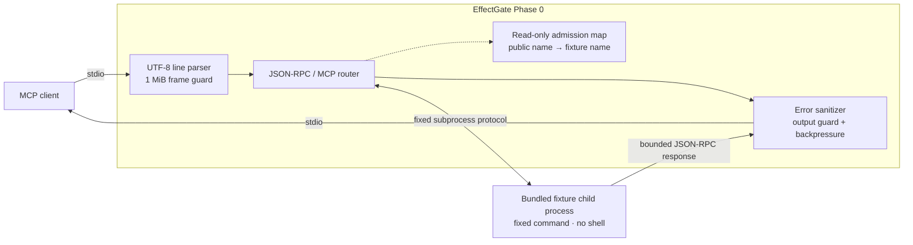

<div align="center">

# EffectGate

### Building a local control point for MCP tool context and effects.

**Design goal:** Spend tokens on reasoning, not tool noise.

[](#phase-0-boundary)
[](https://nodejs.org/)
[](#protocol-surface)
[](LICENSE)
[](poc/package.json)

[Quick start](#quick-start) ·
[Architecture](#architecture) ·
[Protocol](#protocol-surface) ·
[Security](#security-model) ·
[MCP setup](#connect-an-mcp-client)

</div>

> [!CAUTION]
> **Phase 0 is a fixture-only proof of concept.** It cannot launch arbitrary
> backends, execute protected writes, or provide a production security
> boundary.

EffectGate is being built to sit between an AI host and its MCP tools. The
product direction combines two controls that normally live far apart:

1. **Context control** — retain raw tool evidence locally and emit only bounded,
   cited views to the model.
2. **Effect control** — bind approval to an exact intent, then verify or
   reconcile the outcome instead of retrying blindly.

Phase 0 proves the narrow transport and admission spine required before either
claim can be implemented responsibly.

## Quick start

Requires [Node.js 24 or newer](https://nodejs.org/). There are no runtime
packages to install.

```powershell
git clone https://github.com/Miniks040506/EffectGate.git
cd EffectGate
npm --prefix poc test
npm --prefix poc start
```

`npm --prefix poc start` launches a local stdio MCP server backed only by the
bundled deterministic fixture.

## Architecture



There is no network listener. Phase 0 always spawns the bundled fixture with a
fixed Node.js command. `--source` changes only the validated public namespace;
it does not select a backend.

## Implemented invariants

| Boundary | Phase 0 behavior |
|---|---|
| Backend selection | Fixed bundled fixture; arbitrary commands are rejected |
| Process launch | `shell: false` with an explicit environment allowlist |
| Frame size | Incoming and outgoing JSON-RPC frames are limited to 1 MiB |
| Request IDs | Safe integers or UTF-8 strings no longer than 128 bytes |
| Work bound | At most 64 pending backend requests |
| Timeout | Each forwarded request expires after 10 seconds |
| Catalog | Calls require a public name learned from an admitted `tools/list` |
| Name isolation | Backend names cannot be called directly or invented |
| Errors | Backend errors and stderr content are not passed through verbatim |
| Flow control | Client input and fixture output pause while downstream writables are backpressured |

An admitted tool must declare all four metadata conditions:

```text
readOnlyHint     = true
destructiveHint  = false
idempotentHint   = true
openWorldHint    = false
```

For admitted tools, advertised contract fields are forwarded unchanged; only
the name is replaced with a deterministic public namespace. Tool annotations
are still untrusted metadata—not proof that an unknown backend is safe—which
is why external backends remain disabled.

## Protocol surface

Phase 0 uses one UTF-8 JSON-RPC object per stdio line and supports MCP
`2025-11-25` only. This is a deliberately narrow MCP subset, not a protocol
conformance claim.

| Message | Direction | Behavior |
|---|---|---|
| `initialize` | Client → fixture | Requires the Phase 0 MCP version; exposes only the tools capability |
| `notifications/initialized` | Client → fixture | Forwarded |
| `ping` | Client → fixture | Forwarded under shared timeout and pending-work limits |
| `tools/list` | Client → fixture | Validates name and `inputSchema` shape, applies admission metadata, namespaces names, preserves pagination |
| `tools/call` | Client → fixture | Accepts only a public name in the current admission map; the fixture validates arguments |
| `notifications/cancelled` | Client → fixture | Remaps the client request ID to its fixture request |
| `notifications/tools/list_changed` | Fixture → client | Clears the admission map before forwarding |
| Other requests | Client → proxy | Return JSON-RPC `-32601` |
| Unrelated notifications | Either direction | Ignored |

The bundled fixture publishes `fixture__echo` and the second-page
`fixture__echo_again`, both validated string echoes used to exercise catalog
pagination.

## Security model

Phase 0 treats MCP input as adversarial but trusts the local operating-system
user, the Node.js runtime, and the checked-out repository files.

It is **not**:

- an operating-system sandbox;
- an authentication or encryption layer;
- a secret-redaction or tenant-isolation system;
- a durable audit journal;
- an approval, verification, or reconciliation engine;
- an independent JSON Schema validator for tool-call arguments;
- approved for external backends, protected effects, or production use.

Read the full [security policy](SECURITY.md) for reporting, supported versions,
the current threat boundary, and known limitations.

## Connect an MCP client

Point an MCP client at the Phase 0 stdio process using an absolute path:

```json
{
  "mcpServers": {
    "effectgate": {
      "command": "node",
      "args": [
        "/absolute/path/to/EffectGate/poc/effectgate.mjs",
        "mcp",
        "serve"
      ]
    }
  }
}
```

For Claude Code:

```powershell
claude mcp add --transport stdio effectgate -- node /absolute/path/to/EffectGate/poc/effectgate.mjs mcp serve
```

After discovery, ask the client to call `fixture__echo`.

## Verification evidence

```powershell
npm --prefix poc test
```

The dependency-free suite directly verifies:

- fixture initialization, discovery, pagination, and typed calls;
- advertised contract preservation and public-name transformation;
- first-page admission after a second catalog page is loaded;
- 4,096 Unicode code points at the fixture input limit;
- malformed and oversized frame rejection with parser recovery;
- invalid request-ID sanitization without reflecting hidden values;
- direct and invented backend-name rejection;
- fixture admission plus read-only/open-world deny cases;
- arbitrary-backend command refusal.

## Phase 0 boundary

| Available now | Evidence-gated product direction |
|---|---|
| Fixture-only stdio proxy | Reviewed stdio MCP backend adapters |
| Typed read-only admission | Streaming content-addressed result storage |
| Bounded protocol handling | Cited Context Views, projection, search, and paging |
| Deterministic local tests | Token ledger and host comparison benchmarks |
| Sanitized public errors | Intent approval, durable journal, verification, and reconciliation |
| Node.js PoC | Tested installer and supported-platform matrix |

No date or production claim is attached to a future capability until its
acceptance evidence exists.

## Repository layout

```text
.
├── LICENSE
├── README.md
├── SECURITY.md
└── poc/
    ├── effectgate.mjs       # MCP proxy, fixture, and command entry point
    ├── effectgate.test.mjs  # protocol, admission, and failure-path checks
    ├── package.json         # Node version, license, and scripts
    └── README.md            # focused Phase 0 operating notes
```

## License

Copyright holders license EffectGate under the
[Apache License 2.0](LICENSE).

---

<div align="center">

<sub>Small proof first. Production claims only after evidence.</sub>

</div>
