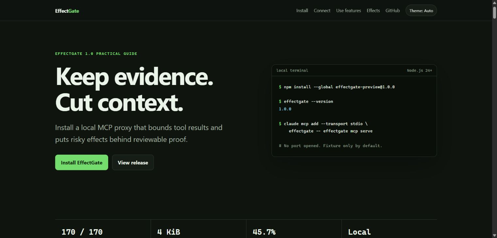
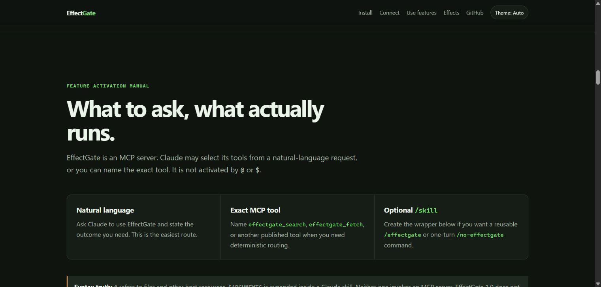
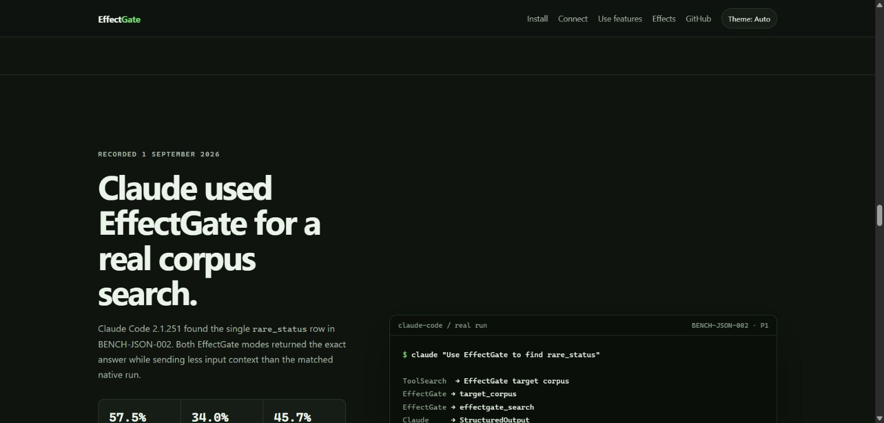

<div align="center">

<h1>EffectGate</h1>

<p><strong>Keep large tool output local. Give AI the cited evidence it needs.</strong></p>

<br>

[](#project-status)
[](https://github.com/Miniks040506/EffectGate/releases/latest)
[](https://nodejs.org/)
[](docs/architecture.md#protocol-surface)
[](LICENSE)
[](poc/package.json)

**[Quick start](#quick-start)** ·
[Full usage guide](https://miniks040506.github.io/EffectGate/) ·
[What it looks like](#what-it-looks-like) ·
[Features](#what-you-get) ·
[Docs](#documentation) ·
[Evidence](#evidence-and-limits)

</div>

<br>

EffectGate is a local MCP proxy. It sits between your AI agent and its tools,
keeps large tool results on disk, and hands the model a small, cited, redacted
view of them instead — then makes tool *writes* provable rather than hopeful.

## The problem

**Tool output is unbounded and permanent.** When an MCP tool returns a 600 KB
log, a 25 MB JSONL export, or a 100k-row CSV, all of it enters the model's
context and stays there. There is no undo — even though the model usually
needed about forty lines. Large tool catalogs charge rent too: every schema you
expose is paid for on every turn, whether or not it is ever called.

**Tool writes are approved once and retried blindly.** An approval granted for
one set of arguments gets reused when the arguments drift. A call that times
out gets retried, and now there are two records instead of one. Nothing proves
whether the effect actually committed.

## What it looks like

<p align="center">
  <a href="https://miniks040506.github.io/EffectGate/"></a>
</p>

<table>
  <tr>
    <td width="50%"><a href="https://miniks040506.github.io/EffectGate/#use-features"></a></td>
    <td width="50%"><a href="https://miniks040506.github.io/EffectGate/#real-run"></a></td>
  </tr>
  <tr>
    <td><strong>Ask or select a tool.</strong> Natural language, exact MCP names, and optional one-turn skills are explained in the live guide.</td>
    <td><strong>Watch the real path.</strong> Tool Search → EffectGate → structured output, reconstructed from a content-free Claude capture.</td>
  </tr>
</table>

### Observed context reduction

| Path | Latest real Claude JSON case | Estimate across 3 observed groups |
|---|---:|---:|
| Typed EffectGate tools (P1) | **57.5% less input** | **38.3% less input** |
| Compact EffectGate tools (P2) | **34.0% less input** | **10.9% less input** |
| **P1 + P2 combined** | **45.7% less input** | **24.6% less input** |

#### P1 typed or P2 compact?

| Mode | What Claude sees | Use it when |
|---|---|---|
| **P1 typed** | Each backend tool keeps its typed name and schema, but Claude loads it only after native Tool Search selects it. | Your host has qualified tool deferral. This is the recommended default and performed best in the latest run. |
| **P2 compact** | Four generic contracts—search, describe, call, and fetch—route to admitted backend tools through arguments. | The catalog is very large or native typed deferral is unavailable or insufficient. Expect extra discovery steps. |

At the individual tool-result level, the bundled 8,000-line fixture reduced
the first bounded view by **99.4%** and a targeted search response by
**99.96%** relative to returning the raw result. Whole-session figures above
use host-reported Claude Code input tokens; fixture figures use the labeled
deterministic byte proxy. The real-host sample is still small, so these are
measured observations—not a saving guarantee for every workload. The native
MCP baseline reached its session ceiling in all three observed groups, while
P1 passed two and P2 passed all three; this is recorded-input evidence, not an
equal-success trial.

## Quick start

Requires [Node.js 24+](https://nodejs.org/). Zero third-party runtime
dependencies.

> [!TIP]
> **New to EffectGate?** Open the
> [interactive installation and usage guide](https://miniks040506.github.io/EffectGate/)
> for platform-specific downloads, MCP setup, the fixture tour, reviewed
> backends, protected effects, recovery commands, and troubleshooting.

### 1. Install

```powershell
npm install --global effectgate-preview@1.0.2
effectgate --version   # must print 1.0.2
```

<details>
<summary>Native installers, or verify the release tarball by hand</summary>

<br>

Qualified MSI, PKG, DEB, and RPM packages are attached to the
[v1.0.2 release](https://github.com/Miniks040506/EffectGate/releases/tag/v1.0.2).
They contain the same dependency-free CLI and do not run npm during install.

The repository install scripts download only the pinned release tarball, check
its SHA-256, and disable lifecycle scripts:

```powershell
.\install\install.ps1 -Check   # then: .\install\install.ps1
```

```sh
./install/install.sh --check   # then: ./install/install.sh
```

To check the digest yourself before installing anything, see
[Release engineering](docs/releasing.md#verify-a-published-release).

</details>

### 2. Connect your agent

Connect once at user scope and reuse the same server in every project and
future Claude Code session:

```powershell
effectgate connect claude
effectgate connect claude --check
```

The command prints the exact server-only permission rule and settings snippet.
It never overwrites Claude settings. If you prefer the underlying Claude Code
command, use:

```powershell
claude mcp add --transport stdio effectgate --scope user -- effectgate mcp serve
```

Use `--scope project` or `--scope local` only when you do not want the server
available in every project.

Any MCP client works — point it at the stdio process:

```json
{
  "mcpServers": {
    "effectgate": {
      "command": "effectgate",
      "args": ["mcp", "serve"]
    }
  }
}
```

This starts a local stdio server backed only by the bundled deterministic
fixture. It opens no port.

### 3. Take the tour

The normal interface is a short request, not an internal tool name:

```text
Use EffectGate. Analyze the demo log, find line 150, and include its citation.
Choose the appropriate EffectGate retrieval operation yourself.
```

Claude should call the routed fixture first to receive a Context View, then
select the matching operation:

- text, errors and evidence use `effectgate_search`;
- JSON, JSONL, CSV, TSV and Markdown fields use `effectgate_project`;
- necessary sequential continuation uses `effectgate_fetch`;
- source editing, builds and browser testing still use normal development tools.

Advanced users can still name an exact tool. New users do not need to copy an
`artifact_id`, construct a cursor or learn the internal sequence.

Add `"includeSecrets": true` to watch redaction fire. The fixture inserts
synthetic sentinels only — never substitute real credentials.

<details>
<summary>Prefer to run from source?</summary>

<br>

```powershell
git clone https://github.com/Miniks040506/EffectGate.git
cd EffectGate
npm --prefix poc test
npm --prefix poc start
```

</details>

## What you get

### Keeping context small

- **Bounded views** — large results stay on disk; the model gets a 4 KiB page
  with an explicit budget and an honestly labeled token count.
- **Real citations** — every page carries an exclusive raw byte range and a
  SHA-256 digest, and reconstructs the source byte-for-byte when nothing was
  redacted.
- **Search, don't page** — literal, source-ordered search returns one cited
  window instead of a scroll through unrelated evidence.
- **Structured projection** — RFC 6901 pointers for JSON/JSONL, header columns
  for CSV/TSV, ATX sections for Markdown, each with per-record citations.
- **Deterministic redaction** — assignment, bearer-token, and prefixed-token
  rules run before *every* emitted page, first or fetched.
- **Withholding over guessing** — opaque or unsupported content returns an
  empty `unavailable` view with no retrieval path, and no invented summary.
- **Compact catalogs** — one flag swaps a large tool catalog for four generic
  contracts: search, describe, call, fetch.

### Making writes provable

- **Intent-bound approval** — approval binds to an exact canonical intent
  digest. Change one argument and it no longer applies.
- **Idempotent dispatch** — a journaled, idempotency-keyed path, so a timeout
  does not become a second write.
- **Verify, don't retry** — after a lost response EffectGate probes for the
  outcome within a bounded budget instead of firing again.
- **Honest uncertainty** — when it cannot prove whether an effect committed, it
  says so and requires manual resolution. It never claims success.
- **Receipts and recovery** — Effect and Phase Receipts, plus operator
  `backup`, `restore`, and `rollback` against verified manifests.
- **Arguments stay private** — exact arguments are reviewable only over a
  user-local socket or named pipe, and never reach the journal.

Both surfaces are covered by a dependency-free suite: **175 tests, zero
third-party imports**. See [Verification evidence](docs/verification.md).

<details>
<summary><strong>Giải thích EffectGate cho khách hàng bằng tiếng Việt</strong></summary>

### EffectGate là gì?

> EffectGate là lớp kiểm soát nằm giữa AI và các công cụ/MCP. Thay vì đưa toàn
> bộ dữ liệu lớn vào context, nó giữ dữ liệu trên máy và chỉ trả về phần cần
> thiết kèm bằng chứng nguồn. Với thao tác ghi đã cấu hình, EffectGate ràng buộc
> approval với đúng ý định để tránh gọi lặp hoặc thay đổi tham số ngoài ý muốn.

#### 1. Giảm dữ liệu đưa vào context

Khi tool trả về log, JSON hoặc bảng rất lớn, EffectGate giữ toàn bộ dữ liệu trên
máy, chỉ đưa cho Claude một phần nhỏ theo giới hạn, cho phép tìm hoặc trích đúng
trường cần thiết và đọc tiếp từng phần khi cần. Điều này giảm input token và
tránh lấp đầy context bằng dữ liệu không liên quan.

#### 2. Trả lời kèm bằng chứng nguồn

Mỗi phần dữ liệu trả về có vị trí byte chính xác, SHA-256 digest, trạng thái đầy
đủ hoặc một phần, cùng citation cho kết quả hay từng record. Người dùng có thể
kiểm tra AI lấy câu trả lời từ đâu thay vì chỉ tin phần tóm tắt.

#### 3. Tìm kiếm và lọc dữ liệu lớn

Claude có thể tìm lỗi trong hàng nghìn dòng log, lọc JSON/JSONL theo điều kiện,
chỉ lấy vài cột từ CSV/TSV hoặc lấy đúng section trong Markdown. Giá trị chính
không phải là “AI đọc nhanh hơn”, mà là AI không cần tải toàn bộ dữ liệu vào
context.

#### 4. Bảo vệ dữ liệu nhạy cảm

EffectGate che token, bearer credential và các giá trị gán nhạy cảm trước mỗi
trang được trả về. Nội dung không rõ hoặc đáng ngờ bị giữ lại thay vì được suy
đoán. Prompt không thể tắt cơ chế redaction này.

#### 5. Kiểm soát công cụ AI được nhìn thấy

EffectGate chỉ công bố capability đã được kiểm tra. Backend phải khớp
executable và digest đã duyệt; tool đọc phải khai báo read-only,
non-destructive và idempotent. Claude không thể tự gọi một backend tool chưa
được công bố, còn compact mode giúp giảm schema tool phải đưa vào context.

#### 6. Kiểm soát thao tác ghi

Với protected effect đã cấu hình, Claude đề xuất thao tác và EffectGate trả về
operation ID để chờ người dùng duyệt. Approval chỉ áp dụng cho đúng tham số ban
đầu; thay đổi file, nội dung hoặc tham số sẽ làm approval cũ mất hiệu lực.

#### 7. Tránh thực hiện một thao tác hai lần

Nếu tool timeout hoặc mất response, EffectGate không tự động ghi lại. Nó kiểm
tra kết quả trước, báo trạng thái không chắc chắn khi chưa thể chứng minh và lưu
receipt phục vụ đối chiếu.

#### 8. Receipt, backup và phục hồi

Operator có thể kiểm tra trạng thái operation, Effect/Phase Receipt, backup đã
xác minh checksum, cùng kế hoạch restore hoặc rollback. Các chức năng effect và
recovery yêu cầu runtime đã được cấu hình, không tự bật chỉ bằng prompt.

</details>

## How it works

EffectGate is one process on your machine with **no network listener**.

A tool can only be called under a public name your client actually learned from
an admitted catalog page — backend names cannot be invented or reached
directly, and an admitted tool must declare itself read-only, non-destructive,
idempotent, and closed-world. Oversized results are retained in a temporary
content-addressed store and served back as bounded pages through
HMAC-authenticated cursors that expire in ten minutes.

Out of the box it proxies only its bundled fixture. Pointing it at a real
backend requires pinning that backend's exact executable and source digests,
its server identity, and a reviewed immutable catalog.

A source-prefixed tool published by an EffectGate server is the admitted,
gated entry point, not a native bypass. Call that tool first; an eligible large
result returns the session-local `artifact_id` used by EffectGate search,
projection, and fetch. Artifact IDs must never be guessed or derived.

→ [Request path, invariants, and every enforced bound](docs/architecture.md)

## Evidence and limits

The percentage table above is the user-facing summary. Reproducible evidence
is available for the [`2.1.241 READ`](poc/evidence/claude-code-target-paired-cell-2.1.241.json),
[`2.1.251 READ`](poc/evidence/claude-code-target-paired-cell-2.1.251.json), and
[`2.1.251 JSON`](poc/evidence/claude-code-target-partial-cell-json-2.1.251.json)
runs. Four automatic routing paths also passed with
[`Claude Code 2.1.259`](poc/evidence/claude-code-routing-2.1.259.json). The full
regression, Tier-1, and campaign accounting lives in
[Verification evidence](docs/verification.md).

> [!CAUTION]
> EffectGate is not an OS sandbox or a comprehensive secret detector. Use the
> bundled fixture first; admit only reviewed read-only backends. Production
> writes and independent external security review remain outside the v1 claim.

## Documentation

| Document | What's inside |
|---|---|
| [Interactive usage guide](https://miniks040506.github.io/EffectGate/) | Install, connect an MCP client, take the fixture tour, run protected effects, and troubleshoot |
| [Architecture](docs/architecture.md) | Request path, invariants, every enforced bound, protocol surface, Context View contract |
| [Connecting real backends](docs/backends.md) | Reviewed third-party stdio backends, verified-effect fixture, operator CLI |
| [Verification evidence](docs/verification.md) | What the 175-test suite actually asserts |
| [Release engineering](docs/releasing.md) | Verify, reproduce, sign, and cut a release; uninstall and purge |
| [Native installers](docs/native-installers.md) | Qualified MSI, PKG, DEB, and RPM packaging and trust boundary |
| [HTTP adapter preview](docs/adapters/streamable-http-json.md) | v1.1 preview: reviewed Streamable HTTP JSON bridge |
| [External review handoff](docs/review/v1.0.0.md) | Scope and required report for an independent auditor |
| [Security policy](SECURITY.md) | Threat boundary, known limitations, private reporting |
| [Changelog](CHANGELOG.md) | Release history |

Machine-readable contracts live in [`contracts/`](contracts/); the
[Context View schema](contracts/context-view.schema.json) is the public
model-visible result contract.

## Contributing

Bug reports and QA findings are welcome as
[issues](https://github.com/Miniks040506/EffectGate/issues). Please run
`npm --prefix poc test` first and include your Node.js and OS versions.

**Do not report vulnerabilities publicly.** Follow the private process in
[SECURITY.md](SECURITY.md).

## License

Licensed under the [Apache License 2.0](LICENSE).

<div align="center">
<br>
<sub>Small proof first. Production claims only after evidence.</sub>
</div>
