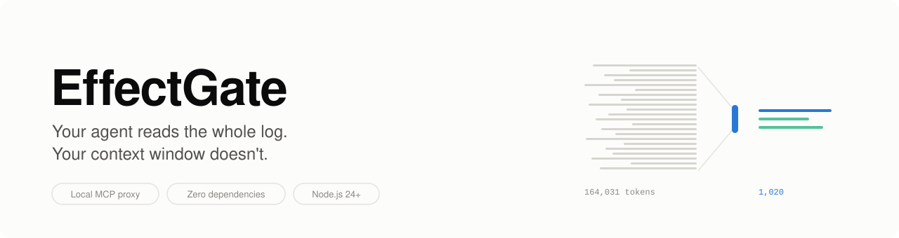
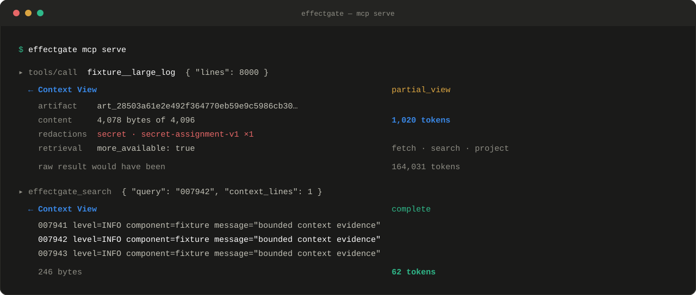
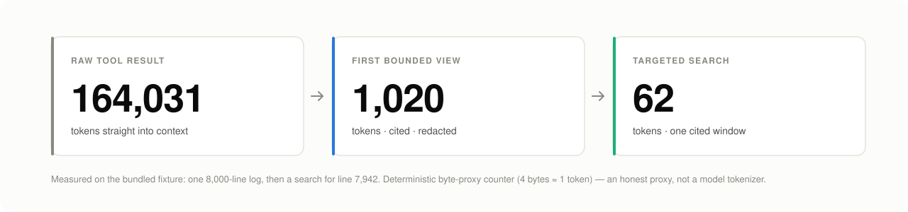

<div align="center">

<picture>
  <source media="(prefers-color-scheme: dark)" srcset="docs/assets/hero-dark.svg">
  
</picture>

<br>

[](#project-status)
[](https://github.com/Miniks040506/EffectGate/releases/latest)
[](https://nodejs.org/)
[](docs/architecture.md#protocol-surface)
[](LICENSE)
[](poc/package.json)

**[Quick start](#quick-start)** ·
[What it looks like](#what-it-looks-like) ·
[Features](#what-you-get) ·
[Docs](#documentation) ·
[Status](#project-status)

</div>

<br>

EffectGate is a local MCP proxy. It sits between your AI agent and its tools,
keeps large tool results on disk, and hands the model a small, cited, redacted
view of them instead — then makes tool *writes* provable rather than hopeful.

## The problem

**Tool output is unbounded and permanent.** When an MCP tool returns a 600 KB
log, a 25 MB JSONL export, or a 100k-row CSV, all of it enters the model's
context and stays there. There is no undo — even though the model usually
needed about forty lines. Large tool catalogs charge rent too: every schema you
expose is paid for on every turn, whether or not it is ever called.

**Tool writes are approved once and retried blindly.** An approval granted for
one set of arguments gets reused when the arguments drift. A call that times
out gets retried, and now there are two records instead of one. Nothing proves
whether the effect actually committed.

## What it looks like

Ask the bundled fixture for an 8,000-line log, then go looking for one line
inside it:



The model never saw the log. It got a bounded page with an exact byte range, a
content digest, and a cursor — and the synthetic API key on line 5 was redacted
before that page left the process. When it wanted line 7,942, it searched
instead of scrolling.

<picture>
  <source media="(prefers-color-scheme: dark)" srcset="docs/assets/savings-dark.svg">
  
</picture>

> These are real figures from `npm --prefix poc start` against the bundled
> fixture, measured with EffectGate's deterministic byte-proxy counter. It is an
> honest proxy, not a model tokenizer, and it does not yet prove a whole-session
> saving — see [Project status](#project-status).

## Quick start

Requires [Node.js 24+](https://nodejs.org/). Zero third-party runtime
dependencies.

### 1. Install

```powershell
npm install --global https://github.com/Miniks040506/EffectGate/releases/download/v1.0.0/effectgate-preview-1.0.0.tgz
effectgate --version   # must print 1.0.0
```

<details>
<summary>Verified installers, or verify the tarball by hand</summary>

<br>

The bundled installers download only the pinned release tarball, check its
SHA-256, and disable lifecycle scripts:

```powershell
.\install\install.ps1 -Check   # then: .\install\install.ps1
```

```sh
./install/install.sh --check   # then: ./install/install.sh
```

To check the digest yourself before installing anything, see
[Release engineering](docs/releasing.md#verify-a-published-release).

</details>

### 2. Connect your agent

```powershell
claude mcp add --transport stdio effectgate -- effectgate mcp serve
```

Any MCP client works — point it at the stdio process:

```json
{
  "mcpServers": {
    "effectgate": {
      "command": "effectgate",
      "args": ["mcp", "serve"]
    }
  }
}
```

This starts a local stdio server backed only by the bundled deterministic
fixture. It opens no port.

### 3. Take the tour

Ask your agent to work through the fixture:

1. `fixture__echo` — a small typed result passes through untouched.
2. `fixture__large_log` with `{"lines": 200}` — get a bounded view.
3. `effectgate_fetch` with the returned cursor while `more_available` is true.
4. `effectgate_search` with the `artifact_id` and a literal query.
5. Ask for `format: "jsonl"`, `"csv"`, or `"markdown"`, then project it with
   `effectgate_project`.

Add `"includeSecrets": true` to watch redaction fire. The fixture inserts
synthetic sentinels only — never substitute real credentials.

<details>
<summary>Prefer to run from source?</summary>

<br>

```powershell
git clone https://github.com/Miniks040506/EffectGate.git
cd EffectGate
npm --prefix poc test
npm --prefix poc start
```

</details>

## What you get

### Keeping context small

- **Bounded views** — large results stay on disk; the model gets a 4 KiB page
  with an explicit budget and an honestly labeled token count.
- **Real citations** — every page carries an exclusive raw byte range and a
  SHA-256 digest, and reconstructs the source byte-for-byte when nothing was
  redacted.
- **Search, don't page** — literal, source-ordered search returns one cited
  window instead of a scroll through unrelated evidence.
- **Structured projection** — RFC 6901 pointers for JSON/JSONL, header columns
  for CSV/TSV, ATX sections for Markdown, each with per-record citations.
- **Deterministic redaction** — assignment, bearer-token, and prefixed-token
  rules run before *every* emitted page, first or fetched.
- **Withholding over guessing** — opaque or unsupported content returns an
  empty `unavailable` view with no retrieval path, and no invented summary.
- **Compact catalogs** — one flag swaps a large tool catalog for four generic
  contracts: search, describe, call, fetch.

### Making writes provable

- **Intent-bound approval** — approval binds to an exact canonical intent
  digest. Change one argument and it no longer applies.
- **Idempotent dispatch** — a journaled, idempotency-keyed path, so a timeout
  does not become a second write.
- **Verify, don't retry** — after a lost response EffectGate probes for the
  outcome within a bounded budget instead of firing again.
- **Honest uncertainty** — when it cannot prove whether an effect committed, it
  says so and requires manual resolution. It never claims success.
- **Receipts and recovery** — Effect and Phase Receipts, plus operator
  `backup`, `restore`, and `rollback` against verified manifests.
- **Arguments stay private** — exact arguments are reviewable only over a
  user-local socket or named pipe, and never reach the journal.

Both surfaces are covered by a dependency-free suite: **163 tests, zero
third-party imports**. See [Verification evidence](docs/verification.md).

## How it works

EffectGate is one process on your machine with **no network listener**.

A tool can only be called under a public name your client actually learned from
an admitted catalog page — backend names cannot be invented or reached
directly, and an admitted tool must declare itself read-only, non-destructive,
idempotent, and closed-world. Oversized results are retained in a temporary
content-addressed store and served back as bounded pages through
HMAC-authenticated cursors that expire in ten minutes.

Out of the box it proxies only its bundled fixture. Pointing it at a real
backend requires pinning that backend's exact executable and source digests,
its server identity, and a reviewed immutable catalog.

→ [Request path, invariants, and every enforced bound](docs/architecture.md)

## Project status

EffectGate is deliberately conservative about what it claims.

> [!CAUTION]
> **Release status is evidence-bound.** v1.0.0 is stable only when its exact
> source commit carries the required Tier-1 evidence and five-role Ed25519
> sign-off. An unqualified checkout is a release candidate, not a production
> security boundary. Redaction remains heuristic, and unreviewed executables or
> undeclared third-party writes are denied.

**The whole-session token claim is not yet proven.** One real-host paired cell
exists — 1 of 320 required campaign slots — and it fails closed:

| Profile | Input tokens | vs. native | Tool calls | Task completed |
|---|---:|---:|---:|:---:|
| P0 native | 253,851 | — | 11 | ✗ budget |
| P1 EffectGate typed | 143,279 | −43.6% | 8 | ✗ session limit |
| P2 EffectGate compact | 212,824 | −16.2% | 14 | ✓ |
| P3 eager diagnostic | 188,057 | −25.8% | 10 | ✗ budget |

The large reduction and the completed task are on *different rows*. Until they
land together, no token-saving claim is made. Raw evidence:
[`poc/evidence/`](poc/evidence/claude-code-target-paired-cell-2.1.241.json).

**EffectGate is not** an OS sandbox, an authentication or encryption layer, a
comprehensive secret/PII detector, a durable audit journal, or approved for
unreviewed backends and production writes. Redaction is three deterministic
rules for high-signal credentials — useful, not exhaustive.

**Sign-off is not independent review.** The five release roles for v1.0.0 were
signed by a single maintainer. That is supply-chain integrity, not separation of
duties. The handoff for a genuine external audit is open:
[`docs/review/v1.0.0.md`](docs/review/v1.0.0.md).

<details>
<summary><strong>Available in 1.0 vs. post-1.0 direction</strong></summary>

<br>

| Available in 1.0 | Post-1.0 direction |
|---|---|
| Fixture proxy, reviewed read-only stdio binding, one digest-pinned effect fixture | Streamable HTTP and broader reviewed adapters |
| Exact executable, identity, catalog, and typed read-only admission pins | Signed backend capability passports and sealed generations |
| Quota-limited partitioned filesystem CAS with explicit invalidation | Durable metadata, shared-writer locking, production GC |
| Cited paging, search, projection, and fail-closed opaque withholding | Ranked search, safe regex policy, streaming indexes, richer predicates |
| HMAC-authenticated process/session-bound cursors | Authenticated OS principal identity and durable policy binding |
| Basis-aware counters, output guards, compact mux, P0–P3 fixture evidence | SQLite-backed evidence and real-host comparison qualification |
| Deterministic tests plus seeded JSONL/MCP and effect fuzz evidence | Broader fuzz, compatibility, latency, and crash qualification |
| Dependency-free Node.js 24 runtime | Registry distribution and platform-native installers |

No date or production claim attaches to a future capability until its
acceptance evidence exists.

</details>

## Documentation

| Document | What's inside |
|---|---|
| [Architecture](docs/architecture.md) | Request path, invariants, every enforced bound, protocol surface, Context View contract |
| [Connecting real backends](docs/backends.md) | Reviewed third-party stdio backends, verified-effect fixture, operator CLI |
| [Verification evidence](docs/verification.md) | What the 163-test suite actually asserts |
| [Release engineering](docs/releasing.md) | Verify, reproduce, sign, and cut a release; uninstall and purge |
| [HTTP adapter preview](docs/adapters/streamable-http-json.md) | v1.1 preview: reviewed Streamable HTTP JSON bridge |
| [External review handoff](docs/review/v1.0.0.md) | Scope and required report for an independent auditor |
| [Security policy](SECURITY.md) | Threat boundary, known limitations, private reporting |
| [Changelog](CHANGELOG.md) | Release history |

Machine-readable contracts live in [`contracts/`](contracts/); the
[Context View schema](contracts/context-view.schema.json) is the public
model-visible result contract.

## Contributing

Bug reports and QA findings are welcome as
[issues](https://github.com/Miniks040506/EffectGate/issues). Please run
`npm --prefix poc test` first and include your Node.js and OS versions.

**Do not report vulnerabilities publicly.** Follow the private process in
[SECURITY.md](SECURITY.md).

## License

Licensed under the [Apache License 2.0](LICENSE).

<div align="center">
<br>
<sub>Small proof first. Production claims only after evidence.</sub>
</div>
