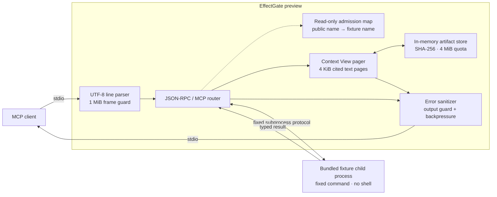

<div align="center">

# EffectGate

### Building a local control point for MCP tool context and effects.

**Design goal:** Spend tokens on reasoning, not tool noise.

[](#current-boundary)
[](https://nodejs.org/)
[](#protocol-surface)
[](LICENSE)
[](poc/package.json)

[Quick start](#quick-start) ·
[Architecture](#architecture) ·
[Protocol](#protocol-surface) ·
[Security](#security-model) ·
[MCP setup](#connect-an-mcp-client)

</div>

> [!CAUTION]
> **This is a fixture-only Phase 1 preview.** Its bounded Context View path is
> real and tested, but it cannot launch arbitrary backends, protect secrets,
> execute writes, or provide a production security boundary.

EffectGate is being built to sit between an AI host and its MCP tools. The
product direction combines two controls that normally live far apart:

1. **Context control** — retain raw tool evidence locally and emit only bounded,
   cited views to the model.
2. **Effect control** — bind approval to an exact intent, then verify or
   reconcile the outcome instead of retrying blindly.

The preview proves the narrow transport and admission spine, then exercises the
first context-control path end to end: a large deterministic log becomes
lossless, cited pages retrieved through opaque cursors.

## Quick start

Requires [Node.js 24 or newer](https://nodejs.org/). There are no runtime
packages to install.

```powershell
git clone https://github.com/Miniks040506/EffectGate.git
cd EffectGate
npm --prefix poc test
npm --prefix poc start
```

`npm --prefix poc start` launches a local stdio MCP server backed only by the
bundled deterministic fixture. No package installation or network listener is
involved.

## Architecture



There is no network listener. The preview always spawns the bundled fixture
with a fixed Node.js command. `--source` changes only the validated public
namespace; it does not select a backend.

## Implemented invariants

| Boundary | Current behavior |
|---|---|
| Backend selection | Fixed bundled fixture; arbitrary commands are rejected |
| Process launch | `shell: false` with an explicit environment allowlist |
| Frame size | Incoming and outgoing JSON-RPC frames are limited to 1 MiB |
| Request IDs | Safe integers or UTF-8 strings no longer than 128 bytes |
| Work bound | At most 64 pending backend requests |
| Timeout | Each forwarded request expires after 10 seconds |
| Lifecycle | Exactly one successful initialization path per stdio process |
| Catalog | Calls require a public name learned from an admitted `tools/list` |
| Name isolation | Backend names cannot be called directly or invented |
| Large text | Exact single-text results without an `outputSchema` are paged above 4 KiB |
| Artifact storage | SHA-256-addressed memory store: 1 MiB per artifact, 4 MiB total, 16 artifacts |
| Tool-result output | Every serialized tool-result value is capped at 64 KiB |
| Retrieval | Random 192-bit cursors; process/session-local with a 10-minute expiry |
| Continuity | Artifacts with an unfetched cursor are pinned; recent same-session retries use a bounded page cache |
| Page bound | At most 4,096 source bytes, cut only at a valid UTF-8 boundary |
| Errors | Backend errors and stderr content are not passed through verbatim |
| Flow control | Client input and fixture output pause while downstream writables are backpressured |

An admitted tool must declare all four metadata conditions:

```text
readOnlyHint     = true
destructiveHint  = false
idempotentHint   = true
openWorldHint    = false
```

For admitted tools, advertised contract fields are forwarded unchanged; only
the name is replaced with a deterministic public namespace. Tool annotations
are still untrusted metadata—not proof that an unknown backend is safe—which
is why external backends remain disabled.

## Context View contract

`fixture__large_log` demonstrates the first bounded-result path. An exact
single-text result at or below 4 KiB passes through unchanged. A larger exact
single-text result is retained in memory and replaced with a v1 Context View
containing:

- the exact UTF-8 source slice and its exclusive byte range;
- stable artifact and SHA-256 integrity digests;
- an explicit source-byte ceiling and honestly labeled byte-proxy token count;
- `partial_view` status whenever the page is not the whole artifact;
- an opaque continuation cursor when more bytes remain;
- an empty redaction report plus a diagnostic that redaction was not performed.

Call `effectgate_fetch` with the returned cursor to retrieve the next page.
Pages are contiguous and reconstruct the original result byte for byte. A
same-session retry returns the cached page while its bounded cursor state is
retained. Expired, modified, cross-process, and unknown cursors all return the
same public error.

> [!NOTE]
> The 4 KiB budget measures source content inside the Context View. MCP and JSON
> envelope bytes are covered by a 64 KiB tool-result limit and the separate
> 1 MiB frame limit. Storage is volatile: artifacts disappear on safe eviction
> or process exit, and cursors also expire after 10 minutes.

## Protocol surface

The preview uses one UTF-8 JSON-RPC object per stdio line and supports MCP
`2025-11-25` only. This is a deliberately narrow MCP subset, not a protocol
conformance claim.

| Message | Direction | Behavior |
|---|---|---|
| `initialize` | Client → EffectGate | Requires the preview MCP version; exposes only the tools capability and starts a fresh cursor session |
| `notifications/initialized` | Client → EffectGate | Completes the lifecycle gate and is forwarded to the fixture |
| `ping` | Client → EffectGate | Forwarded under shared timeout and pending-work limits |
| `tools/list` | Client → EffectGate | Validates name and `inputSchema`, applies admission metadata, namespaces names, preserves pagination, and advertises `effectgate_fetch` |
| `tools/call` | Client → EffectGate | Accepts only an admitted public name; eligible large text is converted to a Context View |
| `effectgate_fetch` | Client → proxy | Consumes an opaque cursor locally and returns the next cited page |
| `notifications/cancelled` | Client → fixture | Remaps the client request ID to its fixture request |
| `notifications/tools/list_changed` | Fixture → client | Clears stale admission before forwarding; active Context View chains remain valid |
| Other requests | Client → proxy | Return JSON-RPC `-32601` |
| Unrelated notifications | Either direction | Ignored |

The bundled fixture publishes `fixture__echo`, `fixture__echo_again`, and
`fixture__large_log`. The first two prove typed-result fidelity and catalog
pagination. The last one supplies deterministic multibyte UTF-8 evidence for
lossless paging tests.

## Security model

The preview treats MCP input as adversarial but trusts the local
operating-system user, the Node.js runtime, and the checked-out repository
files.

It is **not**:

- an operating-system sandbox;
- an authentication or encryption layer;
- a secret-redaction or tenant-isolation system;
- a persistent or streaming content-addressed store;
- a durable audit journal;
- an approval, verification, or reconciliation engine;
- an independent JSON Schema validator for tool-call arguments;
- approved for external backends, protected effects, or production use.

Read the full [security policy](SECURITY.md) for reporting, supported versions,
the current threat boundary, and known limitations.

## Connect an MCP client

Point an MCP client at the preview stdio process using an absolute path:

```json
{
  "mcpServers": {
    "effectgate": {
      "command": "node",
      "args": [
        "/absolute/path/to/EffectGate/poc/effectgate.mjs",
        "mcp",
        "serve"
      ]
    }
  }
}
```

For Claude Code:

```powershell
claude mcp add --transport stdio effectgate -- node /absolute/path/to/EffectGate/poc/effectgate.mjs mcp serve
```

After discovery:

1. Call `fixture__echo` for the typed pass-through path.
2. Call `fixture__large_log` with `{"lines": 200}` for a bounded Context View.
3. While `retrieval.more_available` is true, call `effectgate_fetch` with the
   returned cursor.

## Verification evidence

```powershell
npm --prefix poc test
```

The dependency-free suite directly verifies:

- fixture initialization, discovery, pagination, and typed calls;
- advertised contract preservation and public-name transformation;
- first-page admission after a second catalog page is loaded;
- 4,096 Unicode code points at the fixture input limit;
- unchanged pass-through for small text results;
- v1 Context View fields, exact byte citations, and hard page limits;
- byte-for-byte reconstruction across multibyte UTF-8 page boundaries;
- same-session cursor retry with a byte-identical cached page;
- cursor expiry and cross-store rejection with a non-disclosing public error;
- pinning of artifacts that still have a live continuation;
- whole-result output caps for errors, structured data, and typed results;
- malformed and oversized frame rejection with parser recovery;
- invalid request-ID sanitization without reflecting hidden values;
- direct and invented backend-name rejection;
- fixture admission plus read-only/open-world deny cases;
- arbitrary-backend command refusal.

## Current boundary

| Available in this preview | Evidence-gated product direction |
|---|---|
| Fixture-only stdio proxy | Reviewed stdio MCP backend adapters |
| Typed read-only admission | Signed/pinned backend capability passports |
| Quota-limited in-memory artifact store | Streaming, crash-safe persistent CAS |
| Lossless cited text paging | Search and deterministic JSON/JSONL/CSV projection |
| Opaque session-local fetch cursors | Authenticated principal/client/policy bindings |
| Byte-proxy counts in each view | Token ledger and host comparison benchmarks |
| Deterministic local tests | Compatibility, fuzz, latency, and crash qualification |
| Sanitized public errors | Intent approval, durable journal, verification, and reconciliation |
| Node.js PoC | Tested installer and supported-platform matrix |

No date or production claim is attached to a future capability until its
acceptance evidence exists.

## Repository layout

```text
.
├── LICENSE
├── README.md
├── SECURITY.md
└── poc/
    ├── context-view.mjs     # bounded store, paging, citations, and cursors
    ├── effectgate.mjs       # MCP proxy, fixture, and command entry point
    ├── effectgate.test.mjs  # protocol, paging, isolation, and failure checks
    ├── package.json         # Node version, license, and scripts
    └── README.md            # focused preview operating notes
```

## License

Copyright holders license EffectGate under the
[Apache License 2.0](LICENSE).

---

<div align="center">

<sub>Small proof first. Production claims only after evidence.</sub>

</div>
