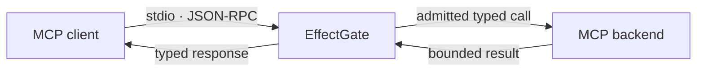

<div align="center">

# EffectGate

### Spend tokens on reasoning, not tool noise.

A local MCP gateway being built for bounded context and verified tool effects.


`Proof of concept · fixture only · not production-ready`

</div>

> [!IMPORTANT]
> Phase 0 proxies only its bundled deterministic fixture. It cannot connect to
> arbitrary backends or execute protected writes.

## Why EffectGate?

AI clients can lose useful context to oversized tool output, while protected
writes need stronger guarantees than “send the request and hope.”

EffectGate is being designed to sit between an MCP client and its tools:



The product direction is bounded, cited context for reads and explicit
approval, verification, and reconciliation for effects. Phase 0 proves only
the smallest transport and admission path needed to begin that work.

## What works today

- MCP `2025-11-25` initialization, ping, paginated tool discovery, and calls.
- Exact typed-contract preservation; only the public tool name is namespaced.
- Read-only, non-destructive, idempotent, closed-world tool admission.
- One MiB input/output frame limits, bounded pending work, and backpressure.
- Sanitized protocol/backend errors with no raw error passthrough.
- Direct backend-name, invented-tool, and arbitrary-command rejection.
- Deterministic tests using only the Node.js standard library.

```text
MCP client
    │
    │ newline-delimited JSON-RPC
    ▼
EffectGate Phase 0
    │
    │ admitted read-only calls
    ▼
Bundled deterministic fixture
```

## Quick start

Requires [Node.js](https://nodejs.org/) 24 or newer.

```powershell
git clone https://github.com/Miniks040506/EffectGate.git
cd EffectGate
npm --prefix poc test
npm --prefix poc start
```

No dependency installation is required.

## Connect an MCP client

Configure an MCP client to launch EffectGate over stdio:

```json
{
  "mcpServers": {
    "effectgate": {
      "command": "node",
      "args": [
        "/absolute/path/to/EffectGate/poc/effectgate.mjs",
        "mcp",
        "serve"
      ]
    }
  }
}
```

For Claude Code:

```powershell
claude mcp add --transport stdio effectgate -- node /absolute/path/to/EffectGate/poc/effectgate.mjs mcp serve
```

The fixture publishes `fixture__echo` and `fixture__echo_again`.

## Phase 0 boundary

| Included | Deliberately deferred |
|---|---|
| Local stdio MCP proxy | Arbitrary/external backends |
| Deterministic read-only fixture | Protected writes and approvals |
| Typed, namespaced tools | Context Views, search, and projection |
| Bounded framing and request limits | SQLite journal and content-addressed storage |
| Built-in deterministic tests | Installer, package registry, and production support |

Tool annotations are admission inputs, not proof that an unknown backend is
safe. External backends remain disabled until policy and effect controls exist.

## Project layout

```text
poc/
├── effectgate.mjs       # MCP proxy, fixture, and command entry point
├── effectgate.test.mjs  # transport, admission, and failure-path checks
├── package.json         # Node version and scripts
└── README.md            # Phase 0 operating notes
```

## Verify

```powershell
npm --prefix poc test
```

The suite covers typed schema fidelity, pagination, Unicode limits, bounded
frames, error sanitization, tool-name isolation, read-only admission, and
arbitrary-backend refusal.

---

<div align="center">

<sub>Small proof first. Production claims only after evidence.</sub>

</div>
