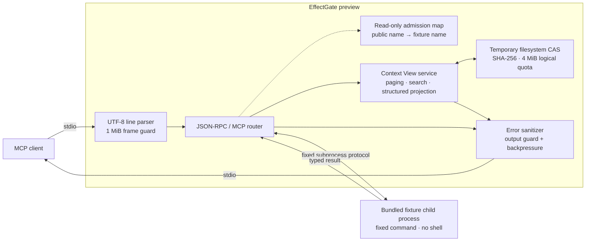

<div align="center">

# EffectGate

### Building a local control point for MCP tool context and effects.

**Design goal:** Spend tokens on reasoning, not tool noise.

[](#current-boundary)
[](poc/package.json)
[](https://nodejs.org/)
[](#protocol-surface)
[](LICENSE)
[](poc/package.json)

[Quick start](#quick-start) ·
[Architecture](#architecture) ·
[Protocol](#protocol-surface) ·
[Security](#security-model) ·
[MCP setup](#connect-an-mcp-client)

</div>

> [!CAUTION]
> **This is a fixture-only Phase 1 preview.** Its bounded Context View path is
> real and tested, but its small heuristic ruleset is not comprehensive secret
> protection. It cannot launch arbitrary backends, execute writes, or provide a
> production security boundary.

EffectGate is being built to sit between an AI host and its MCP tools. The
product direction combines two controls that normally live far apart:

1. **Context control** — retain raw tool evidence locally and emit only bounded,
   cited views to the model.
2. **Effect control** — bind approval to an exact intent, then verify or
   reconcile the outcome instead of retrying blindly.

The preview proves the narrow transport and admission spine, then exercises the
first context-control paths end to end: large deterministic text becomes
bounded, deterministically redacted, cited pages, literal search windows, or
JSON/JSONL, CSV/TSV, and Markdown projections retrieved through opaque cursors.
Oversized untyped result envelopes are retained as serialized JSON, while
unsupported or deterministically opaque content is withheld without inventing
a summary.

## Quick start

Requires [Node.js 24 or newer](https://nodejs.org/). There are no runtime
packages to install.

```powershell
git clone https://github.com/Miniks040506/EffectGate.git
cd EffectGate
npm --prefix poc test
npm --prefix poc start
```

`npm --prefix poc start` launches a local stdio MCP server backed only by the
bundled deterministic fixture. No package installation or network listener is
involved.

## Architecture



There is no network listener. The preview always spawns the bundled fixture
with a fixed Node.js command. `--source` changes only the validated public
namespace; it does not select a backend.

## Implemented invariants

| Boundary | Current behavior |
|---|---|
| Backend selection | Fixed bundled fixture; arbitrary commands are rejected |
| Process launch | `shell: false` with an explicit environment allowlist |
| Frame size | Incoming and outgoing JSON-RPC frames are limited to 1 MiB |
| Request IDs | Safe integers or UTF-8 strings no longer than 128 bytes |
| Work bound | At most 64 pending backend requests |
| Timeout | Each forwarded request expires after 10 seconds |
| Lifecycle | Exactly one successful initialization path per stdio process |
| Catalog | Calls require a public name learned from a `tools/list` page that passed the 64 KiB public-result guard |
| Name isolation | Backend names cannot be called directly or invented |
| Eligible results | Exact text above 4 KiB and oversized untyped envelopes are retained; small text with a redaction or opacity match is bounded too |
| Typed safety | A typed result that needs redaction or opaque handling fails closed instead of violating its `outputSchema` or exposing source bytes |
| Artifact storage | 64 KiB chunk writer into a SHA-256 filesystem CAS: 1 MiB per artifact, 4 MiB logical total, 16 artifacts |
| Finalization | File `fsync`, same-volume atomic rename, startup `.part` cleanup, deduplication, and full-hash read verification |
| Corruption | A missing, truncated, or hash-mismatched object fails closed; corrupt objects are moved to quarantine |
| Tool-result output | Every serialized tool-result value is capped at 64 KiB |
| Opaque content | Unsupported media, private-key armor, and conservative encoded-data matches return metadata-only `unavailable` views with no retrieval path or generated summary |
| Retrieval | HMAC-SHA256 authenticated cursors bind artifact, source view, next position, operation digest, budget, local-principal/client/session/policy digests, expiry, and nonce |
| Search | Case-sensitive literal search: 64-character query, five context lines, 1,024-token maximum, and one cited source-ordered window per page |
| Projection | JSON/JSONL pointer selection, CSV/TSV column selection, and Markdown heading extraction with a 1,000-item slice, 100 logical items per page, and a 1,024-token maximum |
| Continuity | Artifacts with an unfetched cursor are pinned; recent same-session retries use a bounded page cache |
| Page bound | At most 4,096 source bytes, cut only at a valid UTF-8 boundary |
| Redaction | Versioned assignment, bearer-token, and common token-prefix rules run before every emitted page; more than 4,096 detected spans fails closed |
| Errors | Backend errors and stderr content are not passed through verbatim |
| Flow control | Client input and fixture output pause while downstream writables are backpressured |

An admitted tool must declare all four metadata conditions:

```text
readOnlyHint     = true
destructiveHint  = false
idempotentHint   = true
openWorldHint    = false
```

For admitted tools, advertised contract fields are forwarded unchanged; only
the name is replaced with a deterministic public namespace. Tool annotations
are still untrusted metadata—not proof that an unknown backend is safe—which
is why external backends remain disabled.

## Context View contract

The published [Context View JSON Schema](contracts/context-view.schema.json)
and its [token-count definition](contracts/token-ledger.schema.json) are the
machine-readable runtime contract.

`fixture__large_log` demonstrates the first bounded-result path. An eligible
exact single-text result at or below 4 KiB passes through unchanged only when
no redaction or opacity rule matches. Larger exact text and oversized untyped
result envelopes are retained in the temporary CAS; non-text envelopes use
deterministic JSON serialization. The model receives a v1 Context View
containing:

- a deterministically redacted UTF-8 projection and its exclusive raw byte
  range;
- stable artifact and SHA-256 integrity digests;
- an explicit source-byte ceiling and honestly labeled byte-proxy token count;
- `partial_view` status whenever the page is not the whole artifact;
- an explicit `EG-VIEW-002` diagnostic whenever source data was omitted;
- an opaque continuation cursor when more bytes remain;
- redaction class, rule ID, and per-page occurrence counts plus the applied
  ruleset diagnostic.

Call `effectgate_fetch` with the returned cursor to retrieve the next page.
Raw citation ranges are contiguous. Pages reconstruct the original result byte
for byte only when no rule matches; matched bytes are replaced before the first
page or any fetched page leaves EffectGate. A same-session retry returns the
cached page while its bounded cursor state is retained. Cursor envelopes expire
after 10 minutes and contain no raw query or projection arguments. Expired,
modified, cross-process, and unknown cursors all return the same public error.

Call `effectgate_search` with an `artifact_id` and literal `query` to retrieve a
bounded redacted context window. Optional `context_lines` ranges from zero
through five; `max_tokens` ranges from 64 through 1,024 and defaults to 512.
Repeated matches continue through the returned `effectgate_fetch` cursor.
Search is case-sensitive and source-ordered. It does not run regexes, semantic
ranking, or generated summaries. A context line too large for the requested
budget is labeled `partial_view` with an explicit clipping diagnostic.

Call `effectgate_project` with an `artifact_id`, a supported `format`, and an
optional `offset`/`limit` slice:

- `json` and `jsonl` accept RFC 6901 `fields` and scalar equality through
  `filter.pointer`;
- `csv` and `tsv` accept visible header `columns` and string equality through
  `filter.column`;
- `markdown` returns an ATX heading index by default, or the exact heading
  section selected by `heading`.

Structured output is bounded JSONL; Markdown sections remain Markdown.
`record_citations` maps every emitted item to raw source evidence, and
continuation uses `effectgate_fetch`. `max_tokens` ranges from 64 through
1,024 and defaults to 512. Malformed JSONL lines become cited diagnostics;
malformed JSON falls back to bounded redacted text without repair. Malformed
CSV/TSV fails closed because safe column-aware redaction cannot be guaranteed.
Markdown headings inside fenced code blocks are ignored. An item larger than
the requested budget is explicitly omitted with a cited diagnostic.

Unknown media types and content matched by the bounded
`opaque-byte-distribution-v1` screen are retained but return an empty
`unavailable` view. Fetch, search, and projection cannot reveal that artifact,
and EffectGate never labels the withheld bytes as encrypted or generates a
summary. The screen covers private-key headers, long tokens, wrapped base64-like
blocks, wrapped hexadecimal blocks, and bounded byte-distribution windows. It
can produce false positives; it is a fail-closed preview rule, not a secrecy
classifier.

> [!NOTE]
> The 4 KiB budget measures source content inside the Context View. MCP and JSON
> envelope bytes are covered by a 64 KiB tool-result limit and the separate
> 1 MiB frame limit. Session metadata remains volatile. The proxy uses a
> process-owned temporary CAS removed on safe eviction or normal shutdown;
> cursors expire after 10 minutes.

## Protocol surface

The preview uses one UTF-8 JSON-RPC object per stdio line and supports MCP
`2025-11-25` only. This is a deliberately narrow MCP subset, not a protocol
conformance claim.

| Message | Direction | Behavior |
|---|---|---|
| `initialize` | Client → EffectGate | Requires the preview MCP version; exposes only the tools capability and starts a fresh cursor session |
| `notifications/initialized` | Client → EffectGate | Completes the lifecycle gate and is forwarded to the fixture |
| `ping` | Client → EffectGate | Forwarded under shared timeout and pending-work limits |
| `tools/list` | Client → EffectGate | Validates and namespaces tools, enforces the public-result ceiling before admission, preserves pagination, and advertises local fetch/search/project tools |
| `tools/call` | Client → EffectGate | Accepts only an admitted public name; eligible untyped output is bounded, while typed sensitive/opaque output fails closed |
| `effectgate_fetch` | Client → proxy | Consumes an opaque cursor locally and returns the next cited page |
| `effectgate_search` | Client → proxy | Searches a session-owned artifact for a bounded literal context window |
| `effectgate_project` | Client → proxy | Applies bounded JSON/JSONL, CSV/TSV, or Markdown projection with source citations |
| `notifications/cancelled` | Client → fixture | Remaps the client request ID to its fixture request |
| `notifications/tools/list_changed` | Fixture → client | Clears stale admission before forwarding; active Context View chains remain valid |
| Other requests | Client → proxy | Return JSON-RPC `-32601` |
| Unrelated notifications | Either direction | Ignored |

The bundled fixture publishes `fixture__echo`, `fixture__echo_again`, and
`fixture__large_log`. The first two prove typed-result fidelity and catalog
pagination. The last one supplies deterministic multibyte UTF-8, JSONL, CSV,
and Markdown evidence plus an opt-in set of synthetic secret sentinels.

## Security model

The preview treats MCP input as adversarial but trusts the local
operating-system user, the Node.js runtime, and the checked-out repository
files.

It is **not**:

- an operating-system sandbox;
- an authentication or encryption layer;
- a comprehensive secret/PII detector or tenant-isolation system;
- a durable indexed CAS or end-to-end streaming backend adapter;
- a durable audit journal;
- an approval, verification, or reconciliation engine;
- an independent JSON Schema validator for tool-call arguments;
- approved for external backends, protected effects, or production use.

Read the full [security policy](SECURITY.md) for reporting, supported versions,
the current threat boundary, and known limitations.

## Connect an MCP client

Point an MCP client at the preview stdio process using an absolute path:

```json
{
  "mcpServers": {
    "effectgate": {
      "command": "node",
      "args": [
        "/absolute/path/to/EffectGate/poc/effectgate.mjs",
        "mcp",
        "serve"
      ]
    }
  }
}
```

For Claude Code:

```powershell
claude mcp add --transport stdio effectgate -- node /absolute/path/to/EffectGate/poc/effectgate.mjs mcp serve
```

After discovery:

1. Call `fixture__echo` for the typed pass-through path.
2. Call `fixture__large_log` with `{"lines": 200}` for a bounded Context View.
3. While `retrieval.more_available` is true, call `effectgate_fetch` with the
   returned cursor.
4. Call `effectgate_search` with the returned `artifact_id` and a literal query
   to retrieve cited context without paging through unrelated evidence.
5. Request `format: "jsonl"`, `"csv"`, or `"markdown"` from the fixture, then
   pass the returned `artifact_id` and matching format to `effectgate_project`.

For the redaction demonstration, add `"includeSecrets": true`. The fixture
inserts synthetic sentinels only; never substitute real credentials.

## Verification evidence

```powershell
npm --prefix poc test
```

The dependency-free suite directly verifies:

- fixture initialization, discovery, pagination, and typed calls;
- advertised contract preservation and public-name transformation;
- first-page admission after a second catalog page is loaded;
- 4,096 Unicode code points at the fixture input limit;
- unchanged pass-through for small text results;
- v1 Context View fields, exact byte citations, and hard page limits;
- honest byte-proxy token ceilings plus explicit omission diagnostics;
- byte-for-byte reconstruction across multibyte UTF-8 page boundaries;
- assignment, bearer-token, and prefixed-token sentinel removal across every
  first/fetched page;
- fail-closed typed-result handling for all three synthetic secret classes;
- cross-page secret masking and fail-closed redaction-span limits;
- unique, repeated, absent, Unicode, and hard-budget literal searches;
- search-cursor replay plus indistinguishable invented/cross-session artifact
  denials;
- secret-query containment across search content, metadata, and diagnostics;
- JSON/JSONL pointer selection, equality filtering, slicing, cursor replay, and
  per-record citation mapping;
- quoted JSON secret redaction, malformed JSON fallback, cited malformed JSONL
  diagnostics, requested-budget continuation, and oversized-record omission;
- CSV quoting, escaped quotes, embedded newlines, TSV parsing, column
  selection/filtering, structural sensitive-column redaction, and malformed
  table rejection;
- Markdown ATX heading indexes, exact section extraction, fenced-code
  exclusion, secret redaction, paging, and source citation mapping;
- indistinguishable invented and cross-session projection denials;
- same-session cursor retry with a byte-identical cached page;
- authenticated cursor claims, payload/MAC tamper denial, raw-query
  containment, expiry, and cross-store rejection with one public error;
- pinning of artifacts that still have a live continuation;
- atomic filesystem finalization, interrupted `.part` recovery, and
  cross-instance content deduplication;
- full-hash read verification, corruption quarantine, and physical deletion
  only after cursor pins are released;
- whole-result output caps for errors, structured data, and typed results;
- deterministic JSON retention of oversized untyped envelopes and bounded retention
  failure without source-data reflection;
- deterministic opaque-content withholding across initial, search, and
  projection paths, including exact detector boundaries, private-key armor,
  wrapped base64/hex data, final-tail data, and the 1 MiB artifact ceiling;
- oversized catalog-page rejection before tool admission;
- malformed and oversized frame rejection with parser recovery;
- invalid request-ID sanitization without reflecting hidden values;
- direct and invented backend-name rejection;
- fixture admission plus read-only/open-world deny cases;
- arbitrary-backend command refusal.

## Current boundary

| Available in this preview | Evidence-gated product direction |
|---|---|
| Fixture-only stdio proxy | Reviewed stdio MCP backend adapters |
| Typed read-only admission | Signed/pinned backend capability passports |
| Quota-limited temporary filesystem CAS | Durable metadata, shared-writer locking, crash-root recovery, and production GC |
| Cited paging/search/projection plus fail-closed opaque-content withholding | Ranked multi-window search, safe regex policy, streaming indexes, richer predicates, full CommonMark structure, and fuzz qualification |
| HMAC-authenticated process/session-bound cursors with a policy-version binding | Authenticated OS principal/client identity and durable policy-generation binding |
| Byte-proxy counts in each view | Token ledger and host comparison benchmarks |
| Deterministic local tests | Compatibility, fuzz, latency, and crash qualification |
| Sanitized public errors | Intent approval, durable journal, verification, and reconciliation |
| Node.js PoC | Tested installer and supported-platform matrix |

No date or production claim is attached to a future capability until its
acceptance evidence exists.

## Repository layout

```text
.
├── LICENSE
├── README.md
├── SECURITY.md
├── contracts/
│   ├── context-view.schema.json # public model-visible result contract
│   └── token-ledger.schema.json # shared token-count definition
└── poc/
    ├── context-view.mjs     # bounded store, paging, citations, and cursors
    ├── cursor-service.mjs   # authenticated cursor envelopes and replay state
    ├── document-project.mjs # structured projection validation and routing
    ├── effectgate.mjs       # MCP proxy, fixture, and command entry point
    ├── effectgate.test.mjs  # protocol, paging, isolation, and failure checks
    ├── filesystem-cas.mjs   # chunked writes, atomic finalize, and verification
    ├── json-project.mjs     # JSON/JSONL projection
    ├── markdown-project.mjs # ATX heading index and section extraction
    ├── package.json         # Node version, license, and scripts
    ├── tabular-project.mjs  # strict CSV/TSV projection
    └── README.md            # focused preview operating notes
```

## License

Copyright holders license EffectGate under the
[Apache License 2.0](LICENSE).

---

<div align="center">

<sub>Small proof first. Production claims only after evidence.</sub>

</div>
