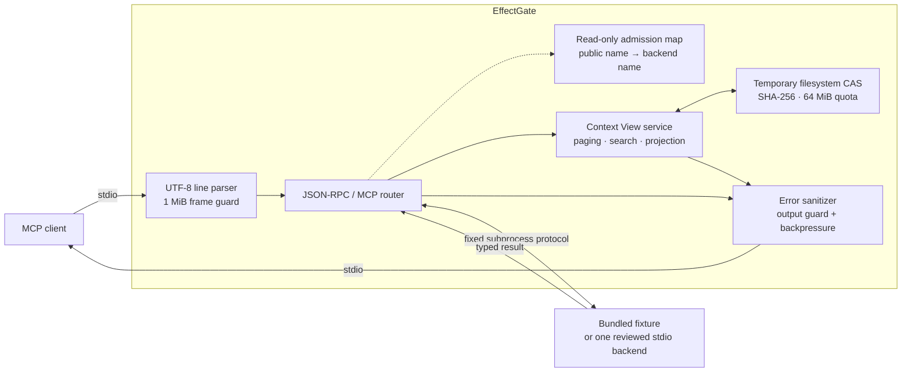

<div align="center">

# EffectGate

### Your agent reads the whole log. Your context window doesn't.

EffectGate is a local MCP proxy that keeps large tool results on disk and hands
your model a small, cited, redacted view of them instead — then makes tool
*writes* provable rather than hopeful.

[](#project-status)
[](https://github.com/Miniks040506/EffectGate/releases/latest)
[](https://nodejs.org/)
[](docs/architecture.md#protocol-surface)
[](LICENSE)
[](poc/package.json)

[Quick start](#quick-start) ·
[See it work](#see-it-work) ·
[Features](#what-you-get) ·
[How it works](#how-it-works) ·
[Docs](#documentation) ·
[Status](#project-status)

</div>

---

## The problem

Two things quietly ruin long agent sessions.

**Tool output is unbounded and permanent.** When an MCP tool returns a 600 KB
log, a 25 MB JSONL export, or a 100k-row CSV, all of it enters the model's
context and stays there. There is no undo — even though the model usually
needed about forty lines. Large tool catalogs charge rent too: every schema you
expose is paid for on every single turn, whether or not it is ever called.

**Tool writes are approved once and retried blindly.** An approval granted for
one set of arguments gets reused when the arguments drift. A call that times
out gets retried, and now there are two records instead of one. Nothing proves
whether the effect actually committed.

EffectGate is one local process, with no network listener, that addresses both.

## See it work

Ask the bundled fixture for an 8,000-line log. Natively that result is
**164,031 byte-proxy tokens** of context, gone forever.

Through EffectGate, this is what the model actually receives:

```json
{
  "schema_version": "1.0.0",
  "artifact_id": "art_28503a61e2e492f364770eb59e9c5986cb30ba5a8234937579dd7baac25d1d51",
  "status": "partial_view",
  "media_type": "text/plain",
  "content": "000001 level=INFO component=fixture message=\"bounded context evidence\"\n000005 … api_key=[REDACTED]\n…",
  "budget": { "max_bytes": 4096, "applied_bytes": 4078, "applied_tokens": 1020, "overflow": "paged" },
  "citations": [{ "byte_start": 0, "byte_end": 4096, "source_digest": "sha256:28503a61…" }],
  "redactions": [{ "class": "secret", "rule_id": "secret-assignment-v1", "count": 1 }],
  "retrieval": { "more_available": true, "operations": ["fetch", "project", "search"], "cursor": "cur_…" },
  "estimated_raw_token_count": { "value": 164031, "basis": "byte_proxy" }
}
```

**1,020 tokens instead of 164,031.** The rest of the log stays on disk,
addressed by digest, one cursor away. The synthetic API key on line 5 was
redacted before the page left the process.

Now suppose the model wants line 7,942. It does not page through eight thousand
lines — it searches:

```jsonc
// effectgate_search { "artifact_id": "art_28503a61…", "query": "007942", "context_lines": 1 }
{
  "status": "complete",
  "content": "007941 level=INFO component=fixture …\n007942 level=INFO component=fixture …\n007943 level=INFO component=fixture …\n",
  "budget": { "applied_bytes": 246, "applied_tokens": 62, "overflow": "none" }
}
```

**62 tokens.** Cited to an exact byte range in a hash-identified artifact — so
when the model quotes that line back to you, it is traceable rather than
remembered.

> Figures above are real output from `npm --prefix poc start` against the
> bundled fixture, measured with EffectGate's deterministic byte-proxy counter
> (4 bytes ≈ 1 token). That is an honest proxy, not a model tokenizer — see
> [Project status](#project-status).

## Quick start

Requires [Node.js 24+](https://nodejs.org/). There are zero third-party runtime
dependencies.

### Install

```powershell
npm install --global https://github.com/Miniks040506/EffectGate/releases/download/v1.0.0/effectgate-preview-1.0.0.tgz
effectgate --version   # must print 1.0.0
```

Verified installers are also available. They download only the pinned release
tarball, check its SHA-256, and disable lifecycle scripts:

```powershell
.\install\install.ps1 -Check   # then: .\install\install.ps1
```

```sh
./install/install.sh --check   # then: ./install/install.sh
```

Prefer to verify the tarball by hand first? See
[Release engineering](docs/releasing.md#verify-a-published-release).

### Connect your MCP client

```json
{
  "mcpServers": {
    "effectgate": {
      "command": "effectgate",
      "args": ["mcp", "serve"]
    }
  }
}
```

For Claude Code:

```powershell
claude mcp add --transport stdio effectgate -- effectgate mcp serve
```

`mcp serve` starts a local stdio server backed only by the bundled
deterministic fixture. It opens no port.

### Or run from source

```powershell
git clone https://github.com/Miniks040506/EffectGate.git
cd EffectGate
npm --prefix poc test
npm --prefix poc start
```

### Take the tour

Once connected, ask your agent to work through the fixture:

1. `fixture__echo` — a small typed result passes through untouched.
2. `fixture__large_log` with `{"lines": 200}` — get a bounded Context View.
3. `effectgate_fetch` with the returned cursor while `more_available` is true.
4. `effectgate_search` with the `artifact_id` and a literal query.
5. Ask for `format: "jsonl"`, `"csv"`, or `"markdown"`, then project it with
   `effectgate_project`.

Add `"includeSecrets": true` to watch redaction fire. The fixture inserts
synthetic sentinels only — never substitute real credentials.

## What you get

### Context control

| | |
|---|---|
| **Bounded views** | Large results are retained locally; the model gets a 4 KiB page with an explicit budget and an honestly labeled token count. |
| **Real citations** | Every page carries an exclusive raw byte range and a SHA-256 artifact digest. Pages reconstruct the source byte-for-byte when no redaction rule matched. |
| **Search, don't page** | Literal, case-sensitive, source-ordered search returns one cited window instead of a scroll through unrelated evidence. |
| **Structured projection** | RFC 6901 pointers for JSON/JSONL, header columns for CSV/TSV, ATX sections for Markdown — each with per-record citations. |
| **Deterministic redaction** | Assignment, bearer-token, and prefixed-token rules run before *every* emitted page, first or fetched. |
| **Withholding over guessing** | Unsupported media and opaque byte patterns return an empty `unavailable` view with no retrieval path — and no invented summary. |
| **Compact catalogs** | `--profile compact_mux` replaces a large tool catalog with four generic contracts: search, describe, call, fetch. |
| **Authenticated cursors** | HMAC-SHA256 tokens binding artifact, position, budget, principal, client, session, policy, expiry, and nonce. |

### Effect control

| | |
|---|---|
| **Intent-bound approval** | Approval binds to an exact canonical intent digest. Change one argument and it no longer applies. |
| **Idempotent dispatch** | A journaled, idempotency-keyed dispatch path, so a timeout does not become a second write. |
| **Verify, don't retry** | After a lost response, EffectGate probes for the outcome within a bounded budget instead of firing again. |
| **Honest uncertainty** | When it cannot prove whether an effect committed, it says so and requires manual resolution — it never claims success. |
| **Receipts and recovery** | Effect and Phase Receipts, plus operator `backup`, `restore`, and `rollback` against verified manifests. |
| **Arguments stay private** | Exact arguments are reviewable only over a user-local socket or named pipe, and are never written to the journal. |

Both surfaces are exercised end to end by a dependency-free suite —
**163 tests, zero third-party imports**. See
[Verification evidence](docs/verification.md).

## How it works



A tool can only be called under a public name the client actually learned from
an admitted `tools/list` page — backend names cannot be invented or reached
directly. Admitted tools must declare `readOnlyHint: true`,
`destructiveHint: false`, `idempotentHint: true`, and `openWorldHint: false`.

**There is no network listener.** Without `--config`, EffectGate spawns only
the bundled fixture, and `--source` changes only its public namespace. A
reviewed configuration may instead bind one exact digest-pinned stdio process —
which requires pinning its executable and source digests, server identity, and
a reviewed immutable catalog. See
[Connecting real backends](docs/backends.md).

## Project status

EffectGate is deliberately conservative about what it claims. Here is the
honest picture.

> [!CAUTION]
> **Release status is evidence-bound.** v1.0.0 is stable only when its exact
> source commit carries the required Tier-1 evidence and five-role Ed25519
> sign-off. An unqualified checkout is a release candidate, not a production
> security boundary. Redaction remains heuristic, and unreviewed executables or
> undeclared third-party writes are denied.

**The token claim is not yet proven end to end.** One real-host paired cell
exists — 1 of 320 required campaign slots — and it fails closed:

| Profile | Input tokens | vs. native | Tool calls | Task completed |
|---|---:|---:|---:|:---:|
| P0 native | 253,851 | — | 11 | ✗ budget |
| P1 EffectGate typed | 143,279 | −43.6% | 8 | ✗ session limit |
| P2 EffectGate compact | 212,824 | −16.2% | 14 | ✓ |
| P3 eager diagnostic | 188,057 | −25.8% | 10 | ✗ budget |

The large reduction and the completed task are on *different rows*. Reduction
and success have not yet been demonstrated together, so no token-saving claim
is made. Raw evidence:
[`poc/evidence/`](poc/evidence/claude-code-target-paired-cell-2.1.241.json).

**EffectGate is not** an OS sandbox, an authentication or encryption layer, a
comprehensive secret/PII detector, a durable audit journal, or approved for
unreviewed backends and production writes. Redaction is three deterministic
rules for high-signal credentials — useful, not exhaustive.

**Sign-off is not independent review.** The five release roles for v1.0.0 were
signed by a single maintainer. That provides supply-chain integrity, not
separation of duties. The handoff for a genuine external audit is open:
[`docs/review/v1.0.0.md`](docs/review/v1.0.0.md).

<details>
<summary><strong>Available in 1.0 vs. post-1.0 direction</strong></summary>

<br>

| Available in 1.0 | Post-1.0 direction |
|---|---|
| Fixture proxy, reviewed read-only stdio binding, one digest-pinned effect fixture | Streamable HTTP and broader reviewed adapters |
| Exact executable, identity, catalog, and typed read-only admission pins | Signed backend capability passports and sealed generations |
| Quota-limited partitioned filesystem CAS with explicit invalidation | Durable metadata, shared-writer locking, production GC |
| Cited paging, search, projection, and fail-closed opaque withholding | Ranked search, safe regex policy, streaming indexes, richer predicates |
| HMAC-authenticated process/session-bound cursors | Authenticated OS principal identity and durable policy binding |
| Basis-aware counters, output guards, compact mux, P0–P3 fixture evidence | SQLite-backed evidence and real-host comparison qualification |
| Deterministic tests plus seeded JSONL/MCP and effect fuzz evidence | Broader fuzz, compatibility, latency, and crash qualification |
| Dependency-free Node.js 24 runtime | Registry distribution and platform-native installers |

No date or production claim attaches to a future capability until its
acceptance evidence exists.

</details>

## Documentation

| Document | What's inside |
|---|---|
| [Architecture](docs/architecture.md) | Invariants, every enforced bound, protocol surface, Context View contract |
| [Connecting real backends](docs/backends.md) | Reviewed third-party stdio backends, verified-effect fixture, operator CLI |
| [Verification evidence](docs/verification.md) | What the 163-test suite actually asserts |
| [Release engineering](docs/releasing.md) | Verify, reproduce, sign, and cut a release; uninstall and purge |
| [HTTP adapter preview](docs/adapters/streamable-http-json.md) | v1.1 preview: reviewed Streamable HTTP JSON bridge |
| [External review handoff](docs/review/v1.0.0.md) | Scope and required report for an independent auditor |
| [Security policy](SECURITY.md) | Threat boundary, known limitations, private reporting |
| [Changelog](CHANGELOG.md) | Release history |

Machine-readable contracts live in [`contracts/`](contracts/); the
[Context View schema](contracts/context-view.schema.json) is the public
model-visible result contract.

## Repository layout

```text
.
├── docs/          # architecture, backends, verification, release, review
├── contracts/     # public JSON Schemas
├── install/       # verified Windows and POSIX installers
└── poc/
    ├── src/
    │   ├── budget/      # token counters, calibration, output guards
    │   ├── context/     # bounded views and authenticated cursors
    │   ├── policy/      # intent, approval, journal, verification, receipts
    │   ├── projection/  # JSON, tabular, and Markdown projection
    │   ├── proxy/       # MCP proxy, fixture, and command entry point
    │   ├── skill/       # phases, capsules, passports, effect adapters
    │   └── storage/     # filesystem content-addressed storage
    ├── test/            # protocol, paging, isolation, and failure checks
    └── evidence/        # source-bound qualification records
```

## Contributing

Bug reports and QA findings are welcome as
[issues](https://github.com/Miniks040506/EffectGate/issues). Please run
`npm --prefix poc test` first and include your Node.js and OS versions.

**Do not report vulnerabilities publicly.** Follow the private process in
[SECURITY.md](SECURITY.md).

## License

Licensed under the [Apache License 2.0](LICENSE).

---

<div align="center">

<sub>Small proof first. Production claims only after evidence.</sub>

</div>
