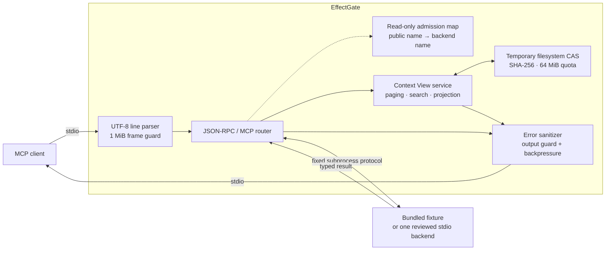

# Architecture

How EffectGate is built, what it guarantees, and every limit it enforces.
This is the reference companion to the [README](../README.md); read that first
for what the runtime is for.

## Request path



A tool can only be called under a public name the client actually learned from
an admitted `tools/list` page. Backend names cannot be invented or reached
directly. There is no network listener: without `--config`, EffectGate spawns
only the bundled fixture, and `--source` changes only its public namespace. A
reviewed configuration may instead bind one exact digest-pinned stdio process.

## Implemented invariants

| Boundary | Current behavior |
|---|---|
| Backend selection | Bundled fixture or one exact reviewed stdio config; command-line backend injection is rejected |
| Process launch | `shell: false` with an explicit environment allowlist |
| Frame size | Incoming and outgoing JSON-RPC frames are limited to 1 MiB |
| Large backend results | The optional EffectGate chunk extension carries one tool result as ordered 512 KiB base64 chunks, with a 32 MiB cumulative cap and final SHA-256 manifest; the client still receives one bounded response |
| Request IDs | Safe integers or UTF-8 strings no longer than 128 bytes |
| Work bound | At most 64 pending backend requests |
| Timeout | Each forwarded request expires after 10 seconds |
| Lifecycle | Exactly one successful initialization path per stdio process |
| Catalog | Calls require a public name learned from a `tools/list` page that passed the 64 KiB public-result guard |
| Compact mux | A session pinned to `compact_mux` exposes only bounded search, describe, call, and authenticated fetch tools; direct typed names are denied |
| Native deferral evidence | Deferral metadata requires an unexpired `pass` manifest, observed Tool Search, and exact client name/version/build match; EG-014B most recently passed on Claude Code 2.1.241 |
| Name isolation | Backend names cannot be called directly or invented |
| Eligible results | Exact text above 4 KiB and oversized untyped envelopes are retained; small text with a redaction or opacity match is bounded too |
| Typed safety | A typed result that needs redaction or opaque handling fails closed instead of violating its `outputSchema` or exposing source bytes |
| Artifact storage | 64 KiB chunk writer into a privacy-partitioned SHA-256 filesystem CAS: 32 MiB per artifact, 64 MiB logical total, 16 artifacts |
| Finalization | File `fsync`, same-volume atomic rename, startup `.part` cleanup, same-partition deduplication, and full-hash read verification |
| Corruption | A missing, truncated, or hash-mismatched object fails closed; corrupt objects are moved to quarantine |
| Tool-result output | Every serialized tool-result value is capped at 64 KiB |
| Opaque content | Unsupported media, private-key armor, and conservative encoded-data matches return metadata-only `unavailable` views with no retrieval path or generated summary |
| Retrieval | HMAC-SHA256 authenticated cursors bind artifact, source view, next position, operation digest, budget, local-principal/client/session/policy digests, expiry, and nonce |
| Search | Case-sensitive literal search: 64-character query, five context lines, 1,024-token maximum, and one cited source-ordered window per page |
| Projection | JSON/JSONL pointer selection, CSV/TSV column selection, and Markdown heading extraction with a 1,000-item slice, 100 logical items per page, and a 1,024-token maximum |
| Continuity | Artifacts with an unfetched cursor are pinned; recent retries use a bounded page cache; explicit invalidation revokes cached and live cursors |
| Page bound | At most 4,096 source bytes, cut only at a valid UTF-8 boundary |
| Redaction | Versioned assignment, bearer-token, and common token-prefix rules run before every emitted page; more than 4,096 detected spans fails closed |
| Benchmark evidence | Seeded P0–P3 order, stable pair/run IDs, warm task timing, alternating long-lived native/proxy latency profiles, real execution of all four small-read fixture profiles, exact frozen LOG/JSON/25 MiB JSONL/CSV context-plane corpora, bounded multi-frame tool-result transport, exclusive JSONL creation, retained failures, deterministic median/p95/bootstrap-CI reports, canonical real-host observation import, four-task target-corpus qualification, and review-only exposure recommendations |
| Errors | Backend errors and stderr content are not passed through verbatim |
| Flow control | Client input and fixture output pause while downstream writables are backpressured |

The commit-bound [EG-047 Tier-1 performance evidence](../poc/evidence/tier1-performance-6c898e2.json)
records four passing platform verdicts, qualification digests, and hosted
artifact digests for the qualified `6c898e2` source revision.

An admitted tool must declare all four metadata conditions:

```text
readOnlyHint     = true
destructiveHint  = false
idempotentHint   = true
openWorldHint    = false
```

For admitted tools, advertised contract fields are forwarded unchanged; only
the name is replaced with a deterministic public namespace. Tool annotations
are still untrusted metadata—not proof that an unknown backend is safe.
Third-party exposure therefore also requires pinned executable/source bytes,
server identity, and an exact reviewed catalog.

## Context View contract

The published [Context View JSON Schema](../contracts/context-view.schema.json)
and its [token-count definition](../contracts/token-ledger.schema.json) are the
machine-readable runtime contract.

`fixture__large_log` demonstrates the first bounded-result path. An eligible
exact single-text result at or below 4 KiB passes through unchanged only when
no redaction or opacity rule matches. Larger exact text and oversized untyped
result envelopes are retained in the temporary CAS; non-text envelopes use
deterministic JSON serialization. The model receives a v1 Context View
containing:

- a deterministically redacted UTF-8 projection and its exclusive raw byte
  range;
- stable artifact and SHA-256 integrity digests;
- an explicit source-byte ceiling and honestly labeled byte-proxy token count;
- `partial_view` status whenever the page is not the whole artifact;
- an explicit `EG-VIEW-002` diagnostic whenever source data was omitted;
- an opaque continuation cursor when more bytes remain;
- redaction class, rule ID, and per-page occurrence counts plus the applied
  ruleset diagnostic.

Call `effectgate_fetch` with the returned cursor to retrieve the next page.
Raw citation ranges are contiguous. Pages reconstruct the original result byte
for byte only when no rule matches; matched bytes are replaced before the first
page or any fetched page leaves EffectGate. A same-session retry returns the
cached page while its bounded cursor state is retained. Cursor envelopes expire
after 10 minutes and contain no raw query or projection arguments. Expired,
modified, cross-process, and unknown cursors all return the same public error.
Repeated identical content reuses one logical artifact and one physical object
only inside its hashed privacy partition. Explicit invalidation removes that
partition's object and revokes every cached replay and live continuation for
the artifact without touching an identical object in another partition.

Token measurements now route through one basis-aware counter abstraction.
Context Views deliberately keep the existing deterministic `byte_proxy`
counter. Injected counters must identify themselves as `tokenizer_exact`,
`tokenizer_estimate`, or `host_reported`; calibrated estimates may include a
bounded disagreement measured against an exact reference counter. The bound is
the maximum `|measured-reference| / max(measured, reference, 1)` across the
provided calibration samples. No tokenizer is bundled, and a host-reported
value is never relabeled as a local measurement or a total-session saving.

One result-budget controller now guards text, search, projection, and
unavailable views. Configured first-view and fetched-page byte/token ceilings
are distinct; a caller may request less but cannot raise either ceiling. Every
view reports the applied limits, measured bytes and tokens, and one explicit
overflow policy from the public schema.

The proxy also guards cumulative model-visible tool catalogs and results. The
default process-local ceiling is 262,144 byte-proxy tokens and can be lowered
with `--max-session-emitted-tokens COUNT`. Identical retries count again;
rejected output does not mutate usage. This is EffectGate output accounting,
not a measurement or guarantee of prompts, assistant output, protocol errors,
or the host's total conversation context.

Pass `--token-ledger FILE` to persist one process session as validated JSONL.
Entries contain stage, direction, byte count, measurement basis, counter
identity/version, input digest, safe category, and trusted artifact/view IDs
when available. Raw tool content and protected arguments are never written.
Byte-proxy values are recomputed when the file is opened; truncated,
inconsistent, cross-session, or malformed ledgers fail closed.

Call `effectgate_search` with an `artifact_id` and literal `query` to retrieve a
bounded redacted context window. Optional `context_lines` ranges from zero
through five; `max_tokens` ranges from 64 through 1,024 and defaults to 512.
Repeated matches continue through the returned `effectgate_fetch` cursor.
Search is case-sensitive and source-ordered. It does not run regexes, semantic
ranking, or generated summaries. A context line too large for the requested
budget is labeled `partial_view` with an explicit clipping diagnostic.

Call `effectgate_project` with an `artifact_id`, a supported `format`, and an
optional `offset`/`limit` slice:

- `json` and `jsonl` accept RFC 6901 `fields` and scalar equality through
  `filter.pointer`;
- `csv` and `tsv` accept visible header `columns` and string equality through
  `filter.column`;
- `markdown` returns an ATX heading index by default, or the exact heading
  section selected by `heading`.

Structured output is bounded JSONL; Markdown sections remain Markdown.
`record_citations` maps every emitted item to raw source evidence, and
continuation uses `effectgate_fetch`. `max_tokens` ranges from 64 through
1,024 and defaults to 512. Malformed JSONL lines become cited diagnostics;
malformed JSON falls back to bounded redacted text without repair. Malformed
CSV/TSV fails closed because safe column-aware redaction cannot be guaranteed.
Markdown headings inside fenced code blocks are ignored. An item larger than
the requested budget is explicitly omitted with a cited diagnostic.

Unknown media types and content matched by the bounded
`opaque-byte-distribution-v1` screen are retained but return an empty
`unavailable` view. Fetch, search, and projection cannot reveal that artifact,
and EffectGate never labels the withheld bytes as encrypted or generates a
summary. The screen covers private-key headers, long tokens, wrapped base64-like
blocks, wrapped hexadecimal blocks, and bounded byte-distribution windows. It
can produce false positives; it is a fail-closed heuristic, not a secrecy
classifier.

> [!NOTE]
> The 4 KiB default bounds model-visible Context View content; text paging also
> bounds its cited source range. MCP and JSON envelope bytes are covered by a
> 64 KiB tool-result limit and the separate 1 MiB frame limit. Session metadata
> remains volatile. The proxy uses a
> process-owned temporary CAS removed on safe eviction or normal shutdown;
> cursors expire after 10 minutes.

## Protocol surface

EffectGate uses one UTF-8 JSON-RPC object per stdio line and supports MCP
`2025-11-25` only. This is a deliberately narrow MCP subset, not a protocol
conformance claim.

| Message | Direction | Behavior |
|---|---|---|
| `initialize` | Client → EffectGate | Requires the supported MCP version, pins the exposure/host-evidence decision, and starts a fresh cursor session |
| `notifications/initialized` | Client → EffectGate | Completes the lifecycle gate and is forwarded to the fixture |
| `ping` | Client → EffectGate | Forwarded under shared timeout and pending-work limits |
| `tools/list` | Client → EffectGate | Validates and namespaces tools, enforces contract/result ceilings, preserves pagination, and publishes either typed tools or the four compact contracts pinned at startup |
| `tools/call` | Client → EffectGate | Accepts only an admitted public name; eligible untyped output is bounded, while typed sensitive/opaque output fails closed |
| `effectgate_fetch` | Client → proxy | Consumes an opaque cursor locally and returns the next cited page |
| `effectgate_search` | Client → proxy | In typed mode, searches a retained artifact; in compact mode, searches bounded metadata for admitted capabilities |
| `effectgate_describe` | Client → proxy | Compact mode only: returns one admitted capability's exact input/output contract |
| `effectgate_call` | Client → proxy | Compact mode only: calls one admitted read-only capability through generic arguments |
| `effectgate_project` | Client → proxy | Applies bounded JSON/JSONL, CSV/TSV, or Markdown projection with source citations |
| `notifications/cancelled` | Client → fixture | Remaps the client request ID to its fixture request |
| `notifications/tools/list_changed` | Fixture → client | Clears stale admission before forwarding; active Context View chains remain valid |
| Other requests | Client → proxy | Return JSON-RPC `-32601` |
| Unrelated notifications | Either direction | Ignored |

The bundled fixture publishes `fixture__echo`, `fixture__echo_again`, and
`fixture__large_log`. The first two prove typed-result fidelity and catalog
pagination. The last one supplies deterministic multibyte UTF-8, JSONL, CSV,
and Markdown evidence plus an opt-in set of synthetic secret sentinels.


## Bounds

| Resource | Limit |
|---|---:|
| JSON-RPC frame | 1 MiB |
| Chunked backend tool result | 512 KiB raw chunks / 32 MiB cumulative / ordered and SHA-256 verified |
| Serialized tool-result value | 64 KiB |
| Local model-visible tool output | 262,144 byte-proxy tokens per process session |
| Optional token ledger | 1,000,000 entries / 64 MiB / one process writer |
| Host compatibility evidence | 16 KiB / strict JSON / exact client and build match / explicit expiry |
| Paired benchmark | 1,000 repetitions / four fixed profiles / one exclusive evidence file |
| Context View source content | 4,096 bytes per first view / fetched page |
| Search query | 64 Unicode characters / 256 UTF-8 bytes |
| Search context | 0–5 lines / 64–1,024 byte-proxy tokens |
| Projection fields | 16 unique JSON Pointers / 256 characters each |
| Projection columns | 16 unique headers / 256 characters each |
| Projection slice | Offset ≤1,048,576 / limit ≤1,000 |
| Projection page | 100 logical items / 64–1,024 byte-proxy tokens |
| Tabular record shape | 256 columns / 64 KiB field / 256 KiB record |
| CAS write chunk | 64 KiB |
| Stored artifact | 32 MiB |
| Logical artifact store | 64 MiB / 16 artifacts |
| Privacy partition key | 128 characters / 512 UTF-8 bytes; stored as SHA-256 path |
| Detected redaction spans | 4,096 per artifact; excess fails closed |
| Opacity screening | Private-key markers, integer-only encoded blocks, 1,024-byte windows, and 128-byte token runs over the capped artifact |
| Cursor token | 2 KiB maximum / HMAC-SHA256 authenticated |
| Cursor states | 64; live continuations are pinned |
| Cursor lifetime | 10 minutes; recent same-session retries are cached |
| Forwarded backend requests | 64 pending / 10 seconds each |

Backends that support EffectGate's optional large-result extension emit ordered
`notifications/effectgate/result_chunk` notifications whose `data` field is
canonical base64, then finish the original request with a
`dev.effectgate/chunked-result` byte-count and SHA-256 manifest. EffectGate
reconstructs only the backend tool-result JSON, retains its content locally,
and sends the client the ordinary bounded Context View result. Missing,
reordered, oversized, non-canonical, or digest-mismatched chunks fail closed.
Backends without this extension retain the normal 1 MiB response-frame limit.

The filesystem objects are atomically finalized and verified before every
page read. Identical content reuses storage only within the same hashed privacy
partition. `ContextStore.invalidate()` removes that partition's object and
revokes cached and live cursors. Session metadata remains volatile and
process-local, and backend results still arrive as complete strings. The
runtime has no durable index,
end-to-end streaming adapter, comprehensive secret/PII detection, regex/ranked
search, JSONPath or richer predicates, full CommonMark structure, SQLite
ledger/multi-writer recovery, real model/host benchmark adapter, externally
qualified compact-mux comparison, semantic argument-diff TUI, fuzz
qualification, or production support claim.

## Security model

EffectGate treats MCP input as adversarial but trusts the local
operating-system user, the Node.js runtime, and the checked-out repository
files.

The default `mcp serve` proxy is **not**:

- an operating-system sandbox;
- an authentication or encryption layer;
- a comprehensive secret/PII detector or tenant-isolation system;
- a durable indexed CAS or end-to-end streaming backend adapter;
- a durable audit journal;
- an independent JSON Schema validator for tool-call arguments;
- approved for unreviewed or write-capable external backends, protected
  effects, or production use.

The separate configured fixture command exercises the existing approval,
journal, idempotency, verification, and receipt kernel against an in-memory
reviewed driver or the exact bundled stdio fixture. EffectGate restarts
recover its journal and reconcile interrupted dispatches without blindly
repeating them. The memory backend is not restart-durable; the stdio fixture
stores idempotency evidence in its own SQLite file. Neither driver authorizes
arbitrary programs, imported modules, or production writes.

Read the full [security policy](../SECURITY.md) for reporting, supported versions,
the current threat boundary, and known limitations.

